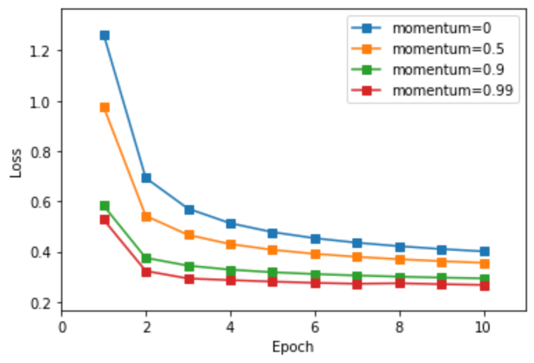
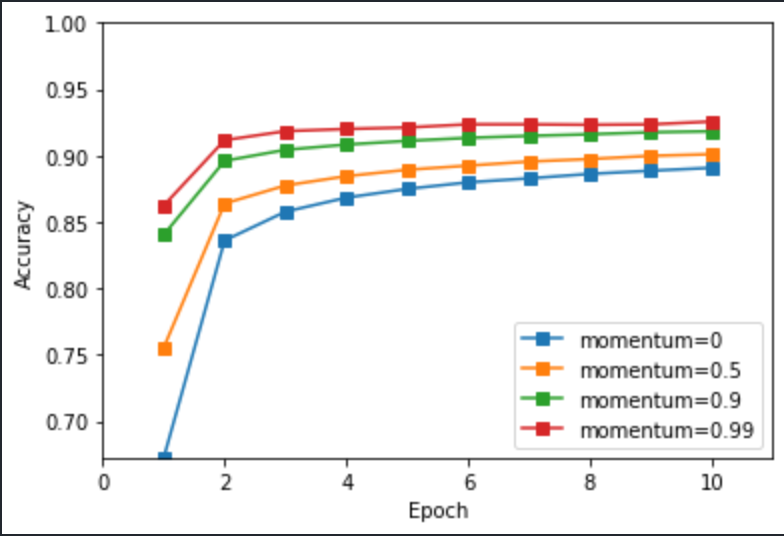
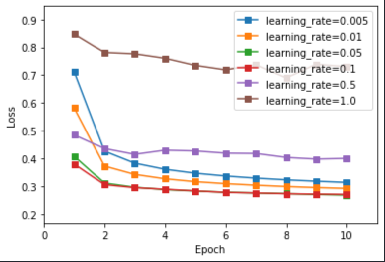
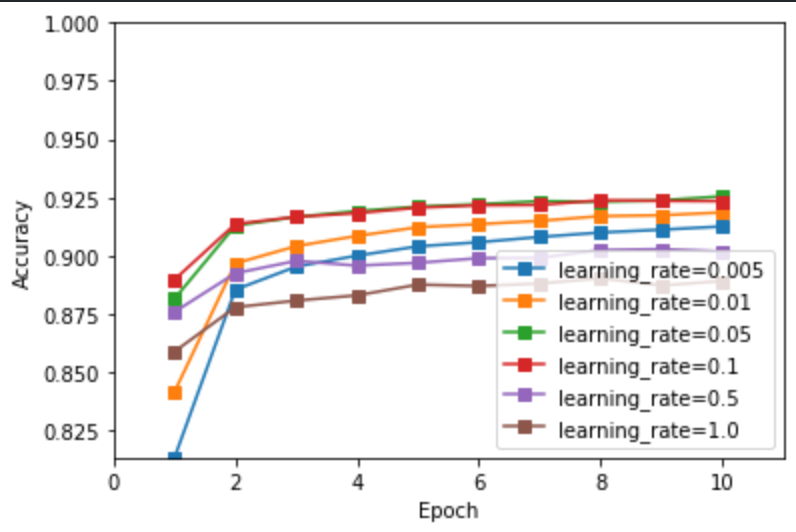
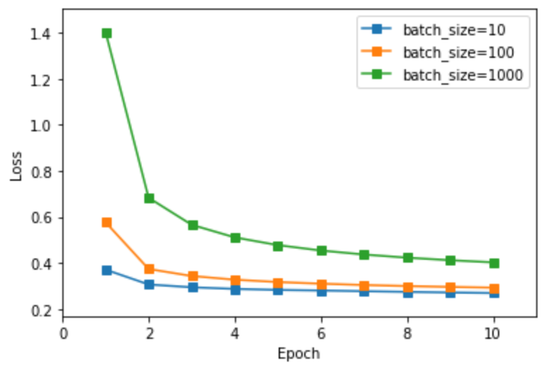
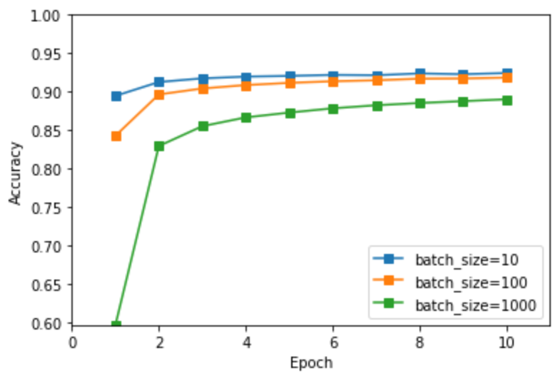
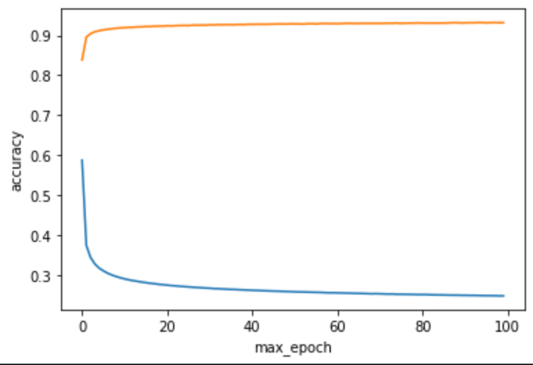

# 实验一报告

## 一. 实验概述与要求

### 1.1 概述

本次案例中，要求用 python 实现 Softmax 回归方法，用于 MNIST 手写数 字数据集分类任务。需要完成前向传播和反向传播算法。前向传播算法中，需要实现 Softmax 函数和交叉熵损失函数的计算。反向传播算法中，你需要实现参数梯度、局部敏感度的计算，并按照随机梯度下降法来更新参数。

MNIST 手写数字数据集是机器学习领域中广泛使用的图像分类数据集。它 包含 60,000 个训练样本和 10,000 个测试样本。这些数字已进行尺寸规格化，并 在固定尺寸的图像中居中。每个样本都是一个 784×1 的矩阵，是从原始的 28×28 灰度图像转换而来的。MNIST 中的数字范围是 0 到 9。

### 1.2 要求

我们提供了完整的代码框架，你只需要完成 **optimizer.py**，**layers/fc_layer.py**，**loss.py** 中的 **#TODO** 部分。你需要提交这三个代码文件和带有结果的 **runner.ipynb** 并且附一个报告内容包括:

a)  记录训练和测试的准确率。画出训练损失和准确率曲线;

b)  比较使用和不使用 momentum 结果的不同，可以从训练时间，收敛性和准确率等方面讨论差异;

c)  调整其他超参数，如学习率，Batchsize 等，观察这些超参数如何影响分    类性能。写下观察结果并将这些新结果记录在报告中。


## 二. 主算法实现

### 2.1 Fully-Connected Layer

#### 2.1.1 forward function

先保存了输入样本，以便之后求偏导使用。

`result`便是`linear transformation` 后 $Wx+b$ 的值。

```python
# Apply linear transformation(Wx+b) to Input, and return results.
# input.shape = (batch_size, features)
self.Input = Input
# W.shape = (features, 10)
# b.shape = (1, 10)
result = np.matmul(Input, self.W) + self.b
# result.shape = (batch_size, 10)
```

#### 2.1.2 backward function

```python
# delta.shape = (batch_size, 10)
# grad_W.shape = (10, features)
self.grad_W = np.transpose(np.matmul(np.transpose(delta), self.Input)/self.Input.shape[0])
# grad_b.shape = (1, 10)
self.grad_b = np.average(delta, axis=0)
```


### 2.2 Softmax with Cross Entropy

#### 2.2.1 forward function

以下两行将输入参数labels转化成one-hot形式，以便之后的计算。

```python
self.onehot_labels = np.zeros(shape=logits.shape)
self.onehot_labels[np.arange(labels.shape[0]),labels] = 1
```

`self.proba`保存了每个样本x所对应的每个分类类别的概率, 即  $h^{(n)}_i = P(t^{(n)}_i = 1|x^{(n)}) = \frac{exp(u^{(n)}_i)}{\sum_{j=1}^K exp(u^{(n)}_j)},\  u^{(n)}_k = \theta^{(k)T}x^{(n)}$. 

而`predictions`就是每个样本中最大probability的值所对应的label类别。

```python
# proba.shape = (batch_size, 10)
self.proba = np.exp(logits)/(np.sum(np.exp(logits),axis=1)[:,np.newaxis])
predictions = np.argmax(self.proba, axis=1)
```

`losses` 保存了当前输入batch中每个样本所对应的损失。即 $E^{(n)}(\theta)=-\sum_{i=1}^K t^{(n)}_iln\ h^{(n)}_i$.

```python
# losses.shape = (batch_size,)
losses = -np.sum(np.multiply(self.onehot_labels,self.proba), axis=1)
```

#### 2.2.2 backward function

`delta`是损失函数对logits做的偏导，即 $\delta^{(n)}_k = \frac{\partial E^{(n)}}{\partial u^{(n)}_k} = -(t^{(n)}_k-h^{(n)}_k)$.

```python
delta = self.proba - self.onehot_labels
```


### 2.3 Stochastic Gradient Descent with Momentum

#### 2.3.1 initialization

在初始化是增加了两个变量`self.V_W` 和 `self.V_b` 分别表示`estimator W`的速率和`estimator b`的速率(velocity)。 初始值为0因为一开始并没有"加速度"。

```python
# __init__():
self.V_W = 0
self.V_b = 0
```

#### 2.3.2 Weight update (with momentum)

计算momentum优化后的$\Delta W$ 和 $\Delta b$, 并更新权值。若momentum=0，便是简单地减去$\Delta W$ 和 $\Delta b$ 来更新权值。即 (i) $v \leftarrow \alpha v - \epsilon g$  (ii) $ \theta \leftarrow \theta + v $

```python
self.V_W = self.momentum * self.V_W - self.learning_rate * layer.grad_W
layer.W += self.V_W
self.V_b = self.momentum * self.V_b - self.learning_rate * layer.grad_b
layer.b += self.V_b
```


## 三. 实验分析

#### 3.1 [momentum比较](https://distill.pub/2017/momentum/)



从上图对比中不难发现momentum越大，loss前期下降的速率越大，accuracy前期上升的速率越大， 即stochastic gradient descent算法的收敛到global optima的速率越大。其原因主要取决于损失函数的curvature/condition（依赖于输入）。

* 当momentum=0，每一次W和b更新的多少仅取决于 learning rate x 当前iteration的gradient.
* 当momentum>0, 每次W和b的更新不仅取决于 learning rate x 当前iteration的gradient，还取决于之前的gradient。若momentum(这个系数)越大，之前的gradient对当前的权重的更新的影响越大, 这是因为$v_t$保存了前面一序列的graidents的趋势/下降方向。另一方面，单个gradient（指没有momentum加持时）容易收到noise的影响而偏离我们要收敛的方向。因此momentum优化了stochastic gradient descent算法， 使其能在更少的iteration内找到global optima。

| momentum | duration(second) |
| -------- | ---------------- |
| 0        | 13.2             |
| 0.5      | 12.9             |
| 0.9      | 11.7             |
| 0.99     | 11.9             |

上表比较了不同momentum下的运行时间 (有些许误差，主要原因是这里并没有严谨的测量，只是用IDE中自动显示的运行时间)。不难发现，在迭代次数相同的情况下，momentum越大，所需训练时间越小，且收敛越快。


#### 3.2 learning rate比较（没有momentum）



从左图中不难发现貌似learning rate越大loss收敛地越快，然而从右图Accuracy展示了不是越大的learning rate越好的，这取决于损失函数。若损失函数是一个理想的平滑的超平面，那么learning rate越大，只会越快地收敛到global optima，而若损失函数是一个非常不平滑的超平面，那么learning rate越大，更有可能收敛在local optima上，效果可能并不理想。


#### 3.3 [batch size比较](https://www.deeplearningbook.org/contents/optimization.html)



从上图中对比中发现batch size越小，loss和accuracy的收敛越快。这里不考虑平行计算的优势的情况下，较小的batch size的randomness越大，使模型具有天然的正则化加成（类似于集成学习中的bootstrap）。


#### 3.4 max epoch比较



从不同打点的max epoch(横坐标)可以看出，max epoch 越大，accuracy越高(橙线)，而loss越小(蓝线)。


## 四. 实验结果

最后， 测试集上的效果如下

| max_epoch | batch_size | learning rate | momentum | accuracy(test) |
| --------- | ---------- | ------------- | -------- | -------------- |
| 10        | 100        | 0.01          | 0        | 0.8989         |
| 10        | 100        | 0.01          | 0.5      | 0.9113         |
| 10        | 100        | 0.01          | 0.9      | 0.9209         |
| 10        | 100        | 0.01          | 0.99     | 0.9213         |

计算置信区间：

一共$10,000$个测试样本，约有$9131$样本误分类的 ( accuracy取$\frac{0.8994+0.9113+0.9204+0.9213}{4} = 0.9131$ )

那么estimate of sample standard deviation $\sigma_ \bar{x} \approx \sqrt{\frac{0.9131(1-0.9131)}{10000}} =0.0028$

结论：本次模型的accuracy score 95%的置信区间 $\approx 0.9131 \pm 1.96 \cdot0.0028 \approx 0.9131 \pm 0.0054 $


