# 实验二报告

## 一. 实验要求

* 记录训练和测试准确率，绘制损失函数和准确率曲线图;
* 比较分别使用 Sigmoid 和 ReLU 激活函数时的结果，可以从收敛情况、准确率等方面比较;
* 比较分别使用欧式距离损失和交叉熵损失时的结果;
* 构造具有两个隐含层的多层感知机，自行选取合适的激活函数和损失函数，与只有一个隐含层的结果相比较;
* 本案例中给定的超参数可能表现不佳，请自行调整超参数尝试取得更好的结果，记录下每组超参数的结果，并作比较和分析。


## 二. 数据集简介

MNIST 手写数字识别数据集是图像分类领域最常用的数据集之一，它包含60,000 张训练图片，10,000 张测试图片，图片中的数字均被缩放到同一尺寸且置 于图像中央，图片大小为 28×28。MNIST 数据集中的每个样本都是一个大小为 784×1 的矩阵(从 28×28 转换得到)。MNIST 数据集中的数字包括 0 到 9 共 10 类，如下图所示。注意，任何关于测试集的信息都不该被引入训练过程。


## 三. 模型构建

### 3.1 Sochastic Gradient Descent

加入了正则项 `self.weightDecay`

``` python
	layer.W -= self.learningRate*(layer.grad_W + self.weightDecay*layer.W)
	layer.b -= self.learningRate*(layer.grad_b + self.weightDecay*layer.b)
```

### 3.2 Fully-Connected Layer

对于隐藏层来说，需在全连接层的backward函数中将后一层`activation function layer`的`delta` 乘上`W `后才能传给前一层。

``` python
### forward function ###
# Apply linear transformation y = Wx + b and return the result
self.Input = Input
return np.matmul(Input, self.W) + self.b
```

```python
### backward function ###
# compute gradient according to delta
self.grad_W = np.transpose(np.matmul(np.transpose(delta), self.Input)/self.Input.shape[0])
self.grad_b = np.average(delta, axis=0)
delta = np.matmul(delta, np.transpose(self.W))
return delta
```

### 3.3 Activation Function Layer

#### 3.3.1 SigmoidLayer

```python
### forward function ###
# Apply Sigmoid on input and return the result
self.Input = Input
return 1/(1+np.exp(-Input))
```

```python
### backward function ###
# compute gradient according to delta
grad = np.exp(-self.Input)/(1+np.exp(-self.Input)**2)
delta = np.multiply(delta, grad)
return delta
```

#### 3.3.2 ReLULayer

```python
### forward funciton ###
# Apply ReLU on input and return the result
self.Input = Input
result = np.maximum(Input, np.zeros(shape=Input.shape))
return result
```

``` python
### backward function ###
# compute gradient according to delta
grad = np.zeros(shape = delta.shape)
row_indices, col_indices = np.where(self.Input > 0)
grad[row_indices, col_indices] = 1
delta = np.multiply(delta, grad)
return delta
```

### 3.4 Loss Layer

#### 3.4.1 Euclidean Loss Layer

```python
### forward function ###
# compute the current minibatch's average accuracy rate and loss and save into self.accu and self.loss respectively(used in solver.py)
self.gt = gt
self.logit = logit
predictions = np.argmax(self.logit, axis=1)
labels = np.where(gt == 1)[1]
losses = np.sum((self.gt-self.logit)**2, axis=1)/2
self.loss = np.mean(losses)
self.acc = len(np.where(predictions == labels)[0])/len(labels)
return self.loss
```

```python
### backward function ###
# compute gradient and return the result(same shape as logit)
delta = self.logit - self.gt
return delta
```

#### 3.4.2 Softmax Cross Entropy Loss Layer

```python
### forward function ### 
# Calculate the average accuracy and loss over the minibatch
# Return the loss and acc, which will be used in solver.py
self.gt = gt
self.proba = np.exp(logit)/(np.sum(np.exp(logit),axis=1)[:,np.newaxis])
predictions = np.argmax(self.proba, axis=1) 
labels = np.where(gt == 1)[1]
losses = -np.sum(np.multiply(self.gt, np.log(self.proba)), axis=1)
self.loss = np.mean(losses)
self.acc = len(np.where(predictions == labels)[0])/len(labels)
return self.loss
```

```python
### backward ###
# Calculate and return the gradient (have the same shape as logits)
delta = self.proba - self.gt
return delta
```


## 四. 不同模型架构对比

### 4.1 Softmax Cross Entropy与Euclidean Loss对比

| Architecture | Euclidean Loss + Sigmoid | Euclidean Loss + ReLU |
| ------------ | ------------------------ | --------------------- |
| 1st layer    | FCLayer(784, 128)        | FCLayer(784, 128)     |
|              | SigmoidLayer             | ReLULayer             |
| 2nd layer    | FCLayer(128, 10)         | FCLayer(128, 10)      |
| loss         | Euclidean Loss           | Euclidean Loss        |

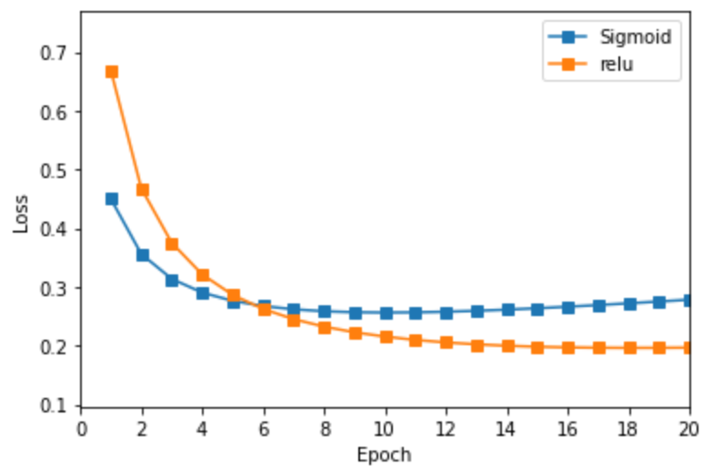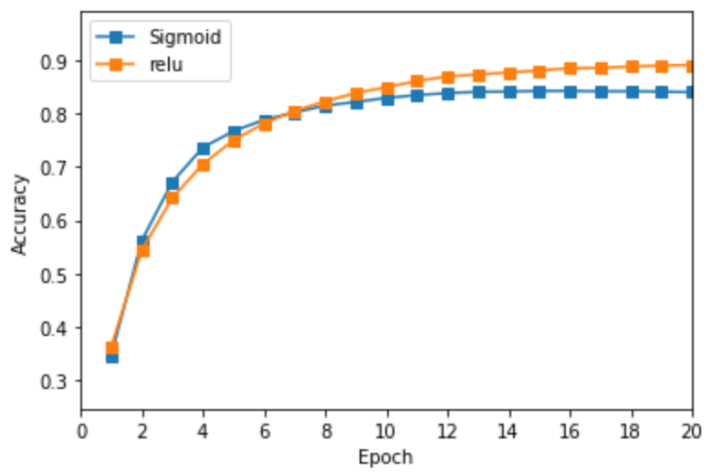

 *Note: 上图为模型使用Euclidean Loss*

| Architecture | Softmax Cross Entropy + Sigmoid | Softmax Cross Entropy + ReLU |
| ------------ | ------------------------------- | ---------------------------- |
| 1st layer    | FCLayer(784, 128)               | FCLayer(784, 128)            |
|              | SigmoidLayer                    | ReLULayer                    |
| 2nd layer    | FCLayer(128, 10)                | FCLayer(128, 10)             |
| loss         | Softmax Cross Entropy           | Softmax Cross Entropy        |

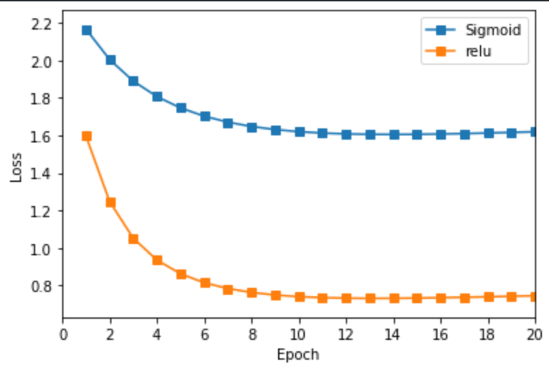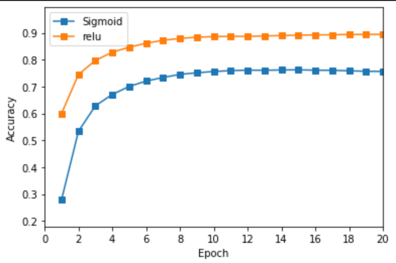

​		*Note: 上图为模型使用Cross Entropy Loss*

讨论：

1. 从上图对比中不难出， 使用ReLU作为激活函数要比Sigmoid的收敛速度越快， 这是自然的，因为当输入大于0时的gradient为1，当输入小于0时gradient为0， 二者始终不变，使得梯度下降时的梯度不会像Sigmoid的那样越乘越小，甚至导致梯度消失。
2. 因为本案例的问题是一个分类问题而非回归问题，因此使用softmax cross entropy效果比计算距离更契合，同时效果更佳。

### 4.2 不同层数的Softmax Cross Entropy对比

| Model Name | model_nohidden        | reluMLP               | model_2hidden         |
| ---------- | --------------------- | --------------------- | --------------------- |
| 1st layer  | FCLayer(784, 10)      | FCLayer(784, 128)     | FCLayer(784, 128)     |
|            |                       | ReLULayer             | ReLULayer             |
| 2nd layer  |                       | FCLayer(128, 10)      | FCLayer(128, 64)      |
|            |                       |                       | ReLULayer             |
| 3rd layer  |                       |                       | FCLayer(64, 10)       |
| loss       | Softmax Cross Entropy | Softmax Cross Entropy | Softmax Cross Entropy |

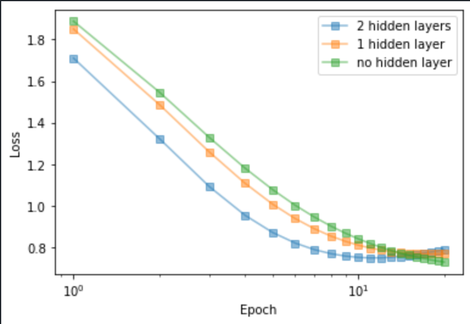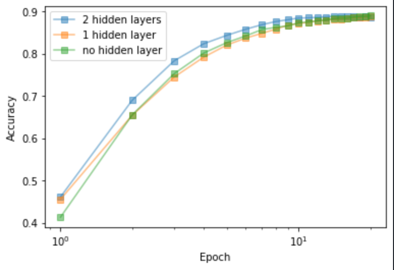


讨论：

从上图中不难看出层数增加时，模型能在更少次的epoch中收敛，即收敛得更快。有趣的是，当仅用一层模型就能达到较好的效果时，增加层数并不会使得效果有。这可能与输入数据的特征和模型本身的算法有关。对于图像输入，CNN的算法更加贴合。


## 五. 调整模型参数

### 5.1 调整batch size

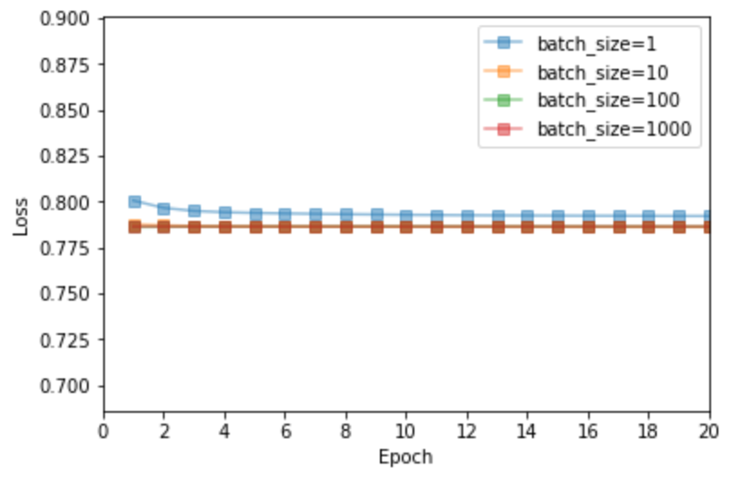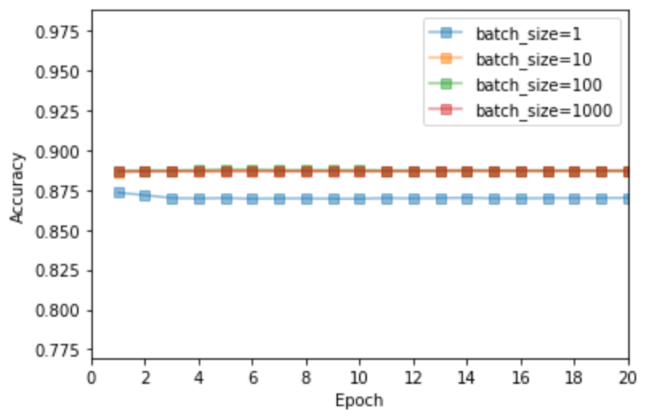


讨论：这里个人不是很确定为什么batch_size为1时的效果会差一点，因为根据实验一的作业经验来看，batch_size越小貌似效果越好。


### 5.2 调整learning rate 

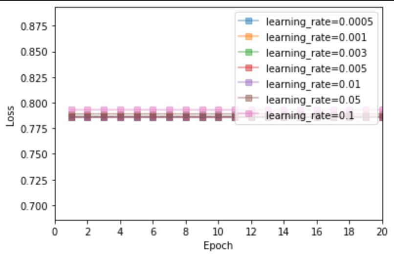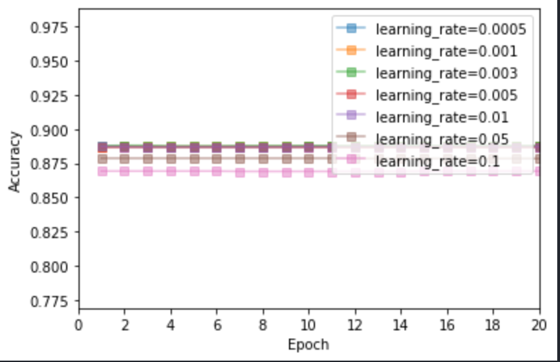


讨论：learning rate并不是越大越好。在本数据集上，learning rate越小越好，这与loss函数的表面的平滑程度（curvature）有关。learning rate有时越大，会错过全局最优解而稳定在局部最优解上。


### 5.3 调整weight decay

 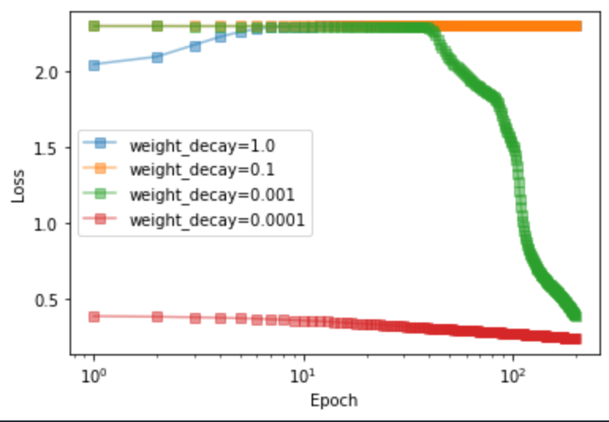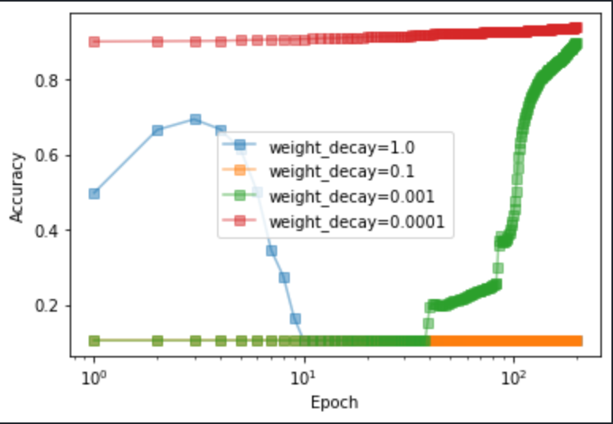


讨论：在本数据集上，因为给定的输入的噪声并不大，因此过拟合的可能性比较小，因此并不需要较大的weight_decay来惩罚模型。


### 5.4 调整max epoch

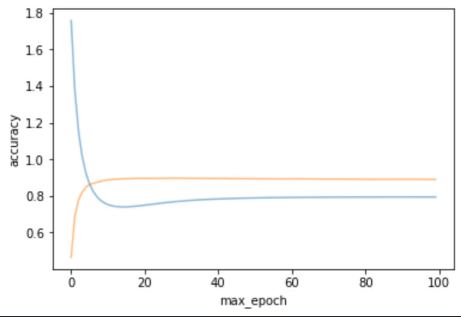

​										                        				*（Note：橙线为Accuracy， 蓝线为Losss）*

讨论：当模型到完全收敛时，增加epoch个数并不能导致模型效果增长。


## 六. 总结

经过调参后构建了最终模型。

| Architecture |                       |
| ------------ | --------------------- |
| 1st layer    | FCLayer(784,128)      |
|              | ReLULayer             |
| 2nd layer    | FCLayer(128, 10)      |
| Loss         | Softmax Cross Entropy |

```python
# 参数设置
batch_size = 100
max_epoch = 25
init_std = 0.01
learning_rate_SGD = 0.005
weight_decay = 0.00001
disp_freq = 50
```

效果：

| train set | validation set | test set |
| --------- | -------------- | -------- |
| 0.9350    | $0.9506$       | $0.9349$ |

计算最终模型的置信区间：

一共$10,000$个测试样本，约有 $9349$ 误分类的.

那么estimate of sample standard deviation $\sigma_ \bar{x} \approx \sqrt{\frac{0.9349(1-0.9349)}{10000}} =0.00247$

结论：本次模型的accuracy score 95%的置信区间$\approx 0.9349 \pm 1.96 \cdot0.00247 \approx 0.9349 \pm 0.0048 $


