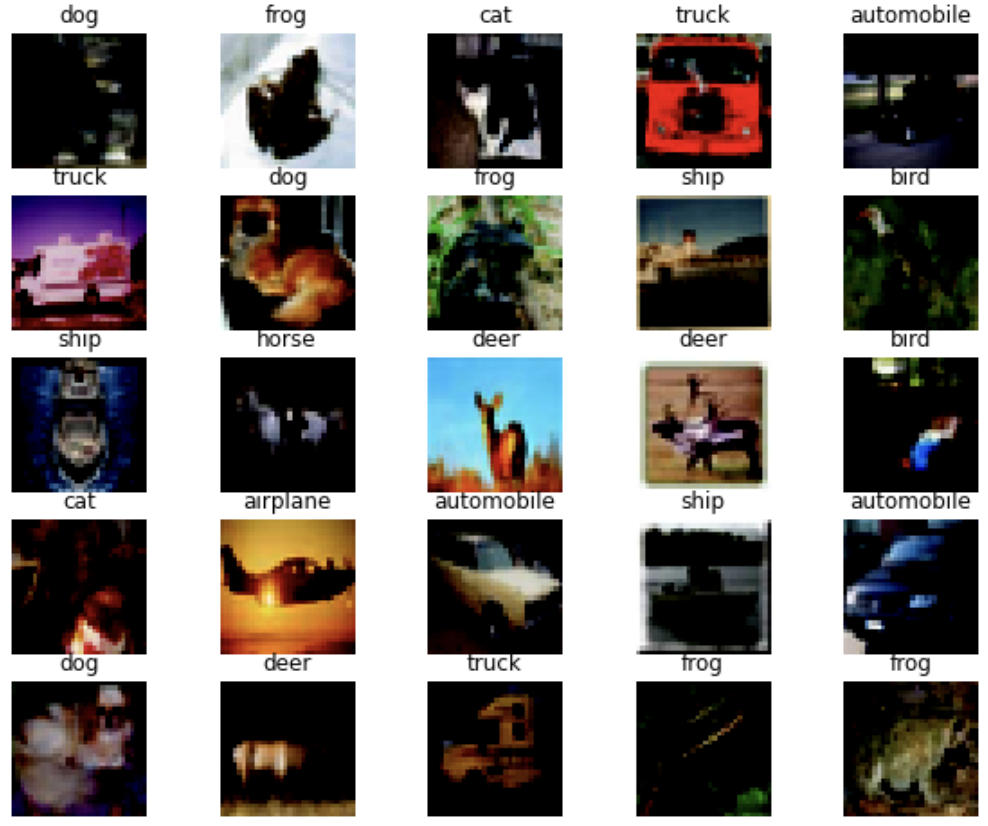
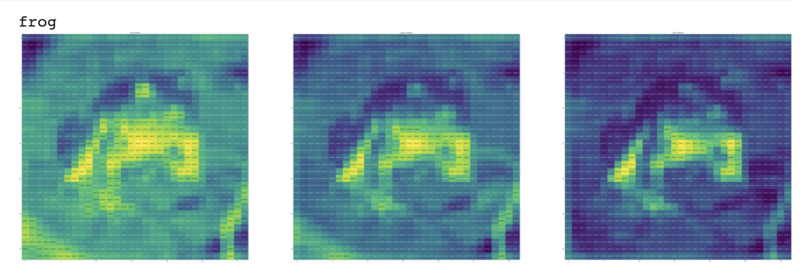
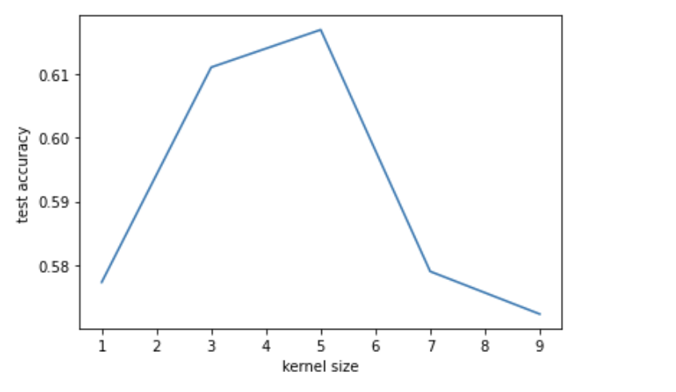
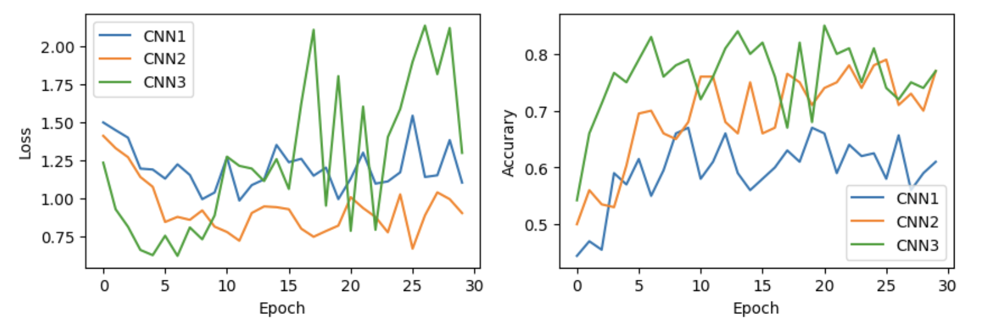
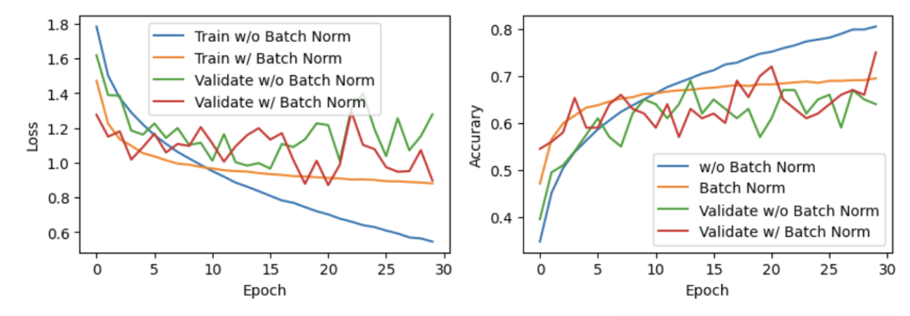
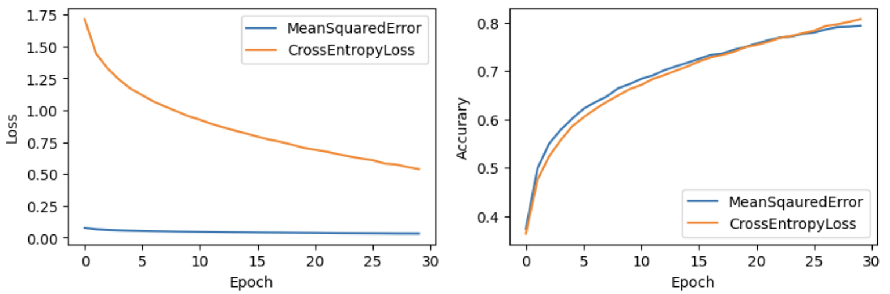
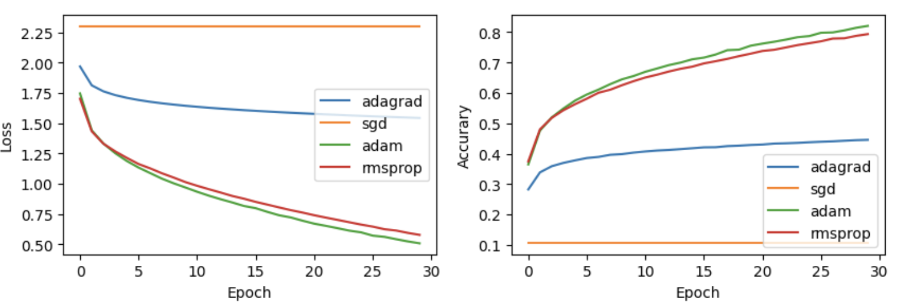
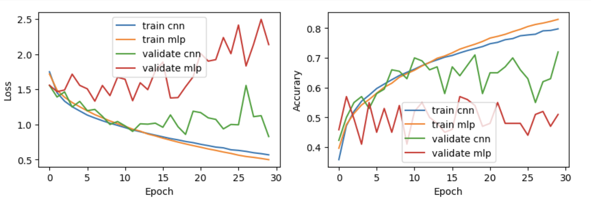

# 实验三报告

## 一. 实验要求

1. 用多层感知机(MLP)和卷积网络(ConvNet)完成CIFAR图像分类

   使用PyTorch分别实现多层感知机(MLP)和卷积网络(ConvNet)，并完成CIFAR图像分类。本案例不提供初始代码，请自行配置网络和选取超参数，包括层数、卷积核数目、激活函数类型、损失函数类型、优化器等方面。

   提交所有代码和一份案例报告，要求如下：

   * 详细介绍所使用的模型及其结果，至少包括超参数选取，损失函数、准确率及其曲线；
   * 比较不同模型配置下的结果，至少从三个方面作比较和分析，例如层数、卷积核数目、激活函数类型、损失函数类型、优化器等。

2. 学习PyTorch ImageNet分类示例
   * 请自行学习PyTorch官方提供的ImageNet分类示例代码，以便更好地完成后续案例(https://github.com/pytorch/examples/tree/master/imagenet)，这部分无需提交代码和报告。

## 二. 数据加载与概览

### 2.1 数据加载

数据来自`torchvision.dataset`中的CIFAR10数据集。

```python
train_data = datasets.CIFAR10(
    root = 'data',
    train = True,
    transform = transforms.Compose(
        [transforms.ToTensor(),
         transforms.Normalize(mean=(0.5, 0.5, 0.5), std=(0.5, 0.5, 0.5))]
    ),
    download = True,
)

test_data = datasets.CIFAR10(
    root = 'data',
    train = False,
    transform = transforms.Compose(
          [transforms.ToTensor(),
           transforms.Normalize(mean=(0.5, 0.5, 0.5), std=(0.5, 0.5, 0.5))]
    )
)
loaders = {
    'train' : torch.utils.data.DataLoader(train_data, 
                                          batch_size=100, 
                                          sampler = train_sampler,
                                          num_workers=3),
    'valid' : torch.utils.data.DataLoader(train_data, 
                                          batch_size = 100, 
                                          sampler = valid_sampler,
                                          num_workers=3),
    'test'  : torch.utils.data.DataLoader(test_data, 
                                          batch_size=100, 
                                          shuffle=True, 
                                          num_workers=3),
}
```

### 2.2 数据预览

```python
import matplotlib.pyplot as plt
import numpy as np

figure = plt.figure(figsize=(10, 8))
cols, rows = 5, 5
for i in range(1, cols * rows + 1):
    sample_idx = torch.randint(len(train_data), size=(1,)).item()
    img, label = train_data[sample_idx]
    ax = figure.add_subplot(rows, cols, i)
    plt.title(label)
    plt.axis("off")
    plt.imshow(np.transpose(img, (1, 2, 0)), interpolation='nearest')
    ax.set_title(classes[label])
plt.show()
```



我们可以将图片展开来观察。

```python
image, label = train_data[0]
rgb_img = np.squeeze(image)
channels = ['red channel', 'green channel', 'blue channel']

fig = plt.figure(figsize=(100,100))
print(classes[label])
for idx in range(rgb_img.shape[0]):
  ax = fig.add_subplot(1,3,idx+1)
  img = rgb_img[idx]
  ax.imshow(img)
  ax.set_title(channels[idx])
  width, height = img.shape
  threshold = img.max()/2.5
  for x in range(width):
      for y in range(height):
          val = np.round(img[x][y]) if img[x][y] !=0 else 0
          ax.annotate(str(val), xy=(y,x),
                  horizontalalignment='center',
                  verticalalignment='center', size=8,
                  color='white' if img[x][y] < threshold else 'black')
```



从上图观察中可以看到，每个channel的二维特征是不同。

## 三. ConvNet调试

### 3.1 基本模型定义

```python
class CNN(nn.Module):
  def __init__(self, kernel_size):
    super(CNN, self).__init__()
    self.conv1 = nn.Conv2d(in_channels=3, out_channels=6, kernel_size=kernel_size)
    self.pool = nn.MaxPool2d(2, 2)
    self.conv2 = nn.Conv2d(in_channels=6, out_channels=16, kernel_size=kernel_size)
    self.fc1 = nn.LazyLinear(out_features=120)
    self.fc2 = nn.Linear(in_features=120, out_features=84)
    self.fc3 = nn.Linear(in_features=84, out_features=10)

  def forward(self, x):
    x = self.pool(F.relu(self.conv1(x)))
    x = self.pool(F.relu(self.conv2(x)))
    x = x.view(x.size(0), -1)
    x = F.relu(self.fc1(x))
    x = F.relu(self.fc2(x))
    x = self.fc3(x)
    return x
```

### 3.2 调试卷积核数目

| kernel size   | 1      | 3      | 5      | 7      | 9      |
| ------------- | ------ | ------ | ------ | ------ | ------ |
| test accuracy | 0.5773 | 0.6111 | 0.6170 | 0.5790 | 0.5723 |




这里对卷积核大小进行了一个调整，kernel_size=3或5都是较优的选择。

### 3.3 调试层数

这里尝试了三个不同架构的CNN模型

```python
# 模型一： 两层conv layer + 三层fc layer
class CNN1(nn.Module):
  def __init__(self):
    super(CNN1, self).__init__()
    self.conv1 = nn.Conv2d(in_channels=3, out_channels=6, kernel_size=3)
    self.pool = nn.MaxPool2d(2, 2)
    self.conv2 = nn.Conv2d(in_channels=6, out_channels=16, kernel_size=3)
    self.fc1 = nn.LazyLinear(120)
    self.fc2 = nn.Linear(120, 84)
    self.fc3 = nn.Linear(84, 10)

  def forward(self, x):
    x = self.pool(F.relu(self.conv1(x)))
    x = self.pool(F.relu(self.conv2(x)))
    x = x.view(x.size(0), -1)
    x = F.relu(self.fc1(x))
    x = F.relu(self.fc2(x))
    x = self.fc3(x)
    return x

# 模型二：三层conv layer + 三层fc layer
class CNN2(nn.Module):
  def __init__(self):
      super(CNN2, self).__init__()
      self.conv1 = nn.Conv2d(3, 16, 3, padding=1)
      self.conv2 = nn.Conv2d(16, 32, 3, padding=1)
      self.conv3 = nn.Conv2d(32, 64, 3, padding=1)
      self.pool = nn.MaxPool2d(2, 2)
      self.fc1 = nn.Linear(64 * 4 * 4, 512)
      self.fc2 = nn.Linear(512, 64)
      self.fc3 = nn.Linear(64, 10)

  def forward(self, x):
      x = self.pool(F.relu(self.conv1(x)))
      x = self.pool(F.relu(self.conv2(x)))
      x = self.pool(F.relu(self.conv3(x)))
      x = x.view(-1, 64 * 4 * 4)
      x = self.dropout(F.relu(self.fc1(x)))
      x = self.dropout(F.relu(self.fc2(x)))
      x = self.fc3(x)
      return x

# 模型三：六层conv layer + 三层fc layer
class CNN3(nn.Module):
    def __init__(self):
        super(CNN3, self).__init__()
        self.conv_layer = nn.Sequential(
            # Conv Layer block 1
            nn.Conv2d(in_channels=3, out_channels=32, kernel_size=3, padding=1),
            nn.ReLU(),
            nn.Conv2d(in_channels=32, out_channels=64, kernel_size=3, padding=1),
            nn.ReLU(),
            nn.MaxPool2d(kernel_size=2, stride=2),
            # Conv Layer block 2
            nn.Conv2d(in_channels=64, out_channels=128, kernel_size=3, padding=1),
            nn.ReLU(),
            nn.Conv2d(in_channels=128, out_channels=128, kernel_size=3, padding=1),
            nn.ReLU(),
            nn.MaxPool2d(kernel_size=2, stride=2),
            # Conv Layer block 3
            nn.Conv2d(in_channels=128, out_channels=256, kernel_size=3, padding=1),
            nn.ReLU(),
            nn.Conv2d(in_channels=256, out_channels=256, kernel_size=3, padding=1),
            nn.ReLU(),
            nn.MaxPool2d(kernel_size=2, stride=2),
        )
        self.fc_layer = nn.Sequential(
            nn.Linear(4096, 1024),
            nn.ReLU(),
            nn.Linear(1024, 512),
            nn.ReLU(),
            nn.Linear(512, 10)
        )

    def forward(self, x):
        x.view(-1, 3*32*32)
        x = self.conv_layer(x)
        x = x.view(x.size(0), -1)
        x = self.fc_layer(x)
        return x
```

|                     | CNN1   | CNN2   | CNN3   |
| ------------------- | ------ | ------ | ------ |
| Train Loss          | 0.4752 | 0.3567 | 0.0575 |
| Train Accuracy      |        | 0.8754 | 0.9822 |
| Validation Loss     | 1.1032 | 0.9035 |        |
| Validation Accuracy | 0.6100 | 0.7700 | 0.7700 |



分析：总体来说，卷积层个数越多，效果更佳，但同时模型预测的效果并不是很稳定（上图为validation set上的结果）。

### 3.4 加入Batch Normalisation

```python
# no batch norm
class CNN(nn.Module):
  def __init__(self):
    super(CNN, self).__init__()
    self.conv1 = nn.Conv2d(in_channels=3, out_channels=6, kernel_size=5)
    self.pool = nn.MaxPool2d(2, 2)
    self.conv2 = nn.Conv2d(in_channels=6, out_channels=16, kernel_size=5)
    self.fc1 = nn.Linear(16 * 5 * 5, 120)
    self.fc2 = nn.Linear(120, 84)
    self.fc3 = nn.Linear(84, 10)

  def forward(self, x):
    x = self.pool(F.relu(self.conv1(x)))
    x = self.pool(F.relu(self.conv2(x)))
    x = x.view(-1, 16 * 5 * 5)
    x = F.relu(self.fc1(x))
    x = F.relu(self.fc2(x))
    x = self.fc3(x)
    return x

# batch norm
class CNN_batchnorm(nn.Module):
  def __init__(self):
    super().__init__()
    self.model = nn.Sequential(
        nn.Conv2d(in_channels=3, out_channels=6, kernel_size=5),
        nn.ReLU(),
        nn.MaxPool2d(2, 2),
        nn.BatchNorm2d(6),
        nn.Conv2d(in_channels=6, out_channels=16, kernel_size=5),
        nn.ReLU(),
        nn.MaxPool2d(2, 2),
        nn.BatchNorm2d(16),
        nn.Flatten(),
        nn.Linear(16 * 5 * 5, 120),
        nn.Linear(120, 84),
        nn.Linear(84, 10)
    )

  def forward(self, x):
    return self.model(x)
```

|                     | batch norm | no batch norm |
| ------------------- | ---------- | ------------- |
| Train Loss          | 0.8802     | 0.5453        |
| Train Accurarcy     | 0.6948     | 0.8051        |
| Validation Loss     | 0.8973     | 1.2779        |
| Validation Accuracy | 0.7500     | 0.6400        |



分析：主要观察上图模型在validation set上的表现，可以看出加入batch normalization的模型比不加入batch normalization的模型在validation set上的总体效果更好。同时也反映了原cnn模型存在过拟合的情况。

### 3.5 调整损失函数类型

|                     | MeanSquaredError | CrossEntropyLoss |
| ------------------- | ---------------- | ---------------- |
| Train Loss          |                  | 0.5381           |
| Train Accuracy      | 0.7931           | 0.8066           |
| Validation Loss     | 0.0604           | 1.1379           |
| Validation Accuracy | 0.5700           | 0.6400           |



分析：对于accuracy这一衡量标准而言，MeanSquaredError与CrossEntropy并无显著差距。对于loss而言，由于其本身算法不同，loss的大小也不相同，这是自然的。

### 3.6 调整优化器

以下的learning rate均为0.001。

|                     | sgd    | adagrad | rmsprop | adam   |
| ------------------- | ------ | ------- | ------- | ------ |
| Trian Loss          | 2.3054 | 1.5440  | 0.5772  | 0.5074 |
| Train Accuracy      | 0.1052 | 0.4457  | 0.7936  | 0.8206 |
| Validation Loss     | 2.2962 | 1.5225  | 1.3441  | 1.4153 |
| Validation Accuracy | 0.1050 | 0.3800  | 0.6500  | 0.6000 |



分析：从上图中可以看出sgd的表现最差，仅对学习率进行单调下降的adagrad其效果就已经有显著的提升，而RMSProp（动态调整学习率）和Adam（动态调整学习率并加上了动量）的效果相差并不是很多。

## 四. MLP与ConvNet 性能比较

```python
# define mlp
class MLP(nn.Module):
  def __init__(self):
    super().__init__()
    self.fc1 = nn.Linear(3*32*32, 120)
    self.fc2 = nn.Linear(120, 84)
    self.fc3 = nn.Linear(84, 10)

  def forward(self, x):
    x = x.view(-1, 3*32*32)
    x = F.relu(self.fc1(x))
    x = F.relu(self.fc2(x))
    x = F.relu(self.fc3(x))
    return x
  
# define CNN
class CNN(nn.Module):
  def __init__(self):
    super(CNN, self).__init__()
    self.conv1 = nn.Conv2d(in_channels=3, out_channels=6, kernel_size=5)
    self.pool = nn.MaxPool2d(2, 2)
    self.conv2 = nn.Conv2d(in_channels=6, out_channels=16, kernel_size=5)
    self.fc1 = nn.Linear(16 * 5 * 5, 120)
    self.fc2 = nn.Linear(120, 84)
    self.fc3 = nn.Linear(84, 10)

  def forward(self, x):
    x = self.pool(F.relu(self.conv1(x)))
    x = self.pool(F.relu(self.conv2(x)))
    x = x.view(-1, 16 * 5 * 5)
    x = F.relu(self.fc1(x))
    x = F.relu(self.fc2(x))
    x = self.fc3(x)
    return x
```

|                     | MLP    | CNN    |
| ------------------- | ------ | ------ |
| Train Loss          |        |        |
| Train Accuracy      |        |        |
| Validation Loss     |        | 0.8272 |
| Validation Accuracy | 0.5100 | 0.7200 |



分析：对比两个模型，在fc layer个数相同的情况下，cnn的表现更佳，这完全可以归功于convolution layer对二维特征提取及描述的优越性。


## 五. 总结

最终模型

```python
class CNN_final(nn.Module):
    def __init__(self):
        super(CNN_final, self).__init__()
        self.conv_layer = nn.Sequential(
            # Conv Layer block 1
            nn.Conv2d(in_channels=3, out_channels=32, kernel_size=3, padding=1),
            nn.ReLU(),
            nn.BatchNorm2d(32),
            nn.Conv2d(in_channels=32, out_channels=64, kernel_size=3, padding=1),
            nn.ReLU(),
            nn.MaxPool2d(kernel_size=2, stride=2),

            # Conv Layer block 2
            nn.Conv2d(in_channels=64, out_channels=128, kernel_size=3, padding=1),
            nn.ReLU(),
            nn.BatchNorm2d(128),
            nn.Conv2d(in_channels=128, out_channels=128, kernel_size=3, padding=1),
            nn.ReLU(),
            nn.MaxPool2d(kernel_size=2, stride=2),
            # Conv Layer block 3
            nn.Conv2d(in_channels=128, out_channels=256, kernel_size=3, padding=1),
            nn.ReLU(),
            nn.BatchNorm2d(256),
            nn.Conv2d(in_channels=256, out_channels=256, kernel_size=3, padding=1),
            nn.ReLU(),
            nn.MaxPool2d(kernel_size=2, stride=2),
        )
        self.fc_layer = nn.Sequential(
            nn.Dropout(p=0.1),
            nn.Linear(4096, 1024),
            nn.ReLU(),
            nn.Linear(1024, 512),
            nn.ReLU(),
            nn.Dropout(p=0.1),
            nn.Linear(512, 10)
        )

    def forward(self, x):
        x.view(-1, 3*32*32)
        x = self.conv_layer(x)
        x = x.view(x.size(0), -1)
        x = self.fc_layer(x)
        return x
```

结果：

```
Test Accuracy of the model on the 10000 test images: 0.8244
```

计算最终模型的置信区间：

一共$10,000$个测试样本，约有 $0.8244$ 误分类的.

那么estimate of sample standard deviation $\sigma_ \bar{x} \approx \sqrt{\frac{0.8244(1-0.8244)}{10000}} =0.003804$

结论：本次模型的accuracy score 95%的置信区间$\approx 0.8244 \pm 1.96 \cdot0.003804 \approx 0.8244 \pm 0.0075 $
