# 实验三报告

## 一. 实验要求

本次案例将使用深度学习技术来完成脑部MRI(磁共振)图像分割任务，即对于处理好的一张MRI 图像，通过神经网络分割出其中病变的区域。本次案例使用的数据集来自Kaggle[1]，共包含110 位病人的MRI 数据，每位病人对应多张
通道数为3 的.tiff 格式图像，其对应的分割结果为单通道黑白图像(白色为病变区域)，示例如下。

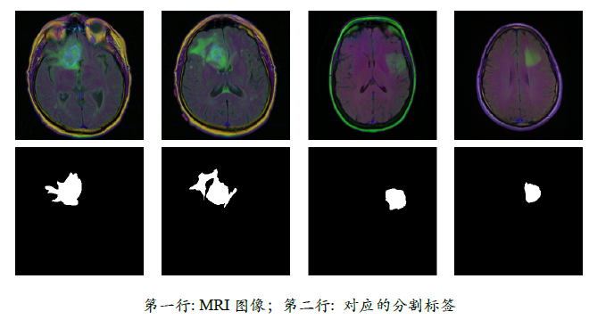

在参考程序的基础上，使用深度学习技术，尝试提升该模型在脑部MRI 图像上的分割效果，以程序最终输出的validation mean DSC 值作为评价标准(参考程序约为90%)。可从网络结构(替换U-Net)、损失函数(替换Dice Loss)、训练过程(如优化器)等角度尝试改进，还可参考通用图像分割的一些技巧[8]。


## 二. 原模型(base line)

以下为无修改的给定模型的训练结果。

```
Best validation mean DSC: 0.910742
```

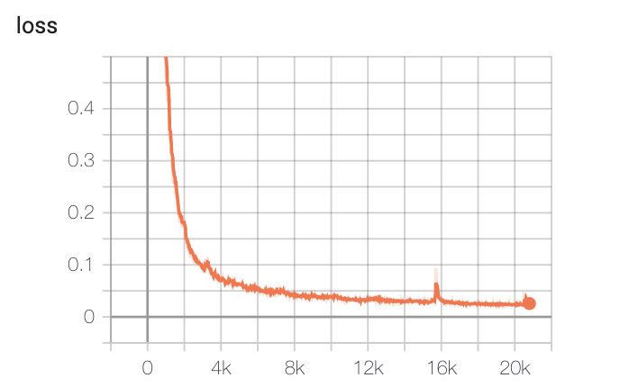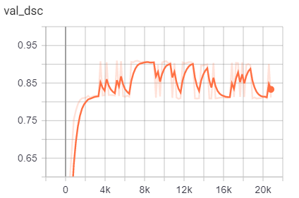


如上图所示，原模型的loss随着epoch次数稳定下降至$0.2147$,  validation dsc值也相对稳定在$0.80$与$0.90$之间，逐步收敛于$0.90$.

UNet的架构：semantic pathway  + geometric pathway，使得模型既可以对每个pixel有语义上的分类（非病变v.s.病变），同时使得每个pixel在整张图像中的定位跟准确。


## 三. 模型架构改进

以下基于给定的UNet模型在架构上做了不同的改进。

### 3.1 UNet with skip connection

由于原架构一共有$(encoders)\ 2 \times 4 + (bottleneck)\ 1 \times 2 + (decoders)\ 2 \times 4 + (last\ convnet)\ 1  = 19 \ layers$ ， 于是借鉴了ResNet的结构，在UNet的每个block中加上了skip connection。对于dimension不配的情况，使用了projection shortcut，即1x1 convnet来做了一次"identity mapping"。

```
Best validation mean DSC: 0.903760
```

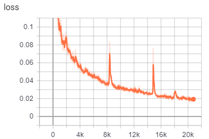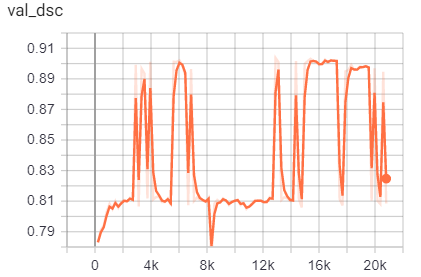

从上图来看，loss的下降（低至0.175653），以及val_dsc（达到0.80851）的变化不是很稳定，浮动范围较大，且在100个epoch中并无收敛的迹象，这有可能是skip connection导致给feature map带来了一定程度的噪声(猜测)。或许当encoder和decoder中层数更多时，skip connection的效果更能体现。

```python
## implementation

class UNetSkipConn(nn.Module):

    def __init__(self, in_channels=3, out_channels=1, init_features=32):
        super(UNetSkipConn, self).__init__()

        features = init_features
        self.encoder1 = UNetSkipConn._block(in_channels, features, name="enc1")
        self.pool1 = nn.MaxPool2d(kernel_size=2, stride=2)
        self.shortcut1 = UNetSkipConn._conv1x1(in_channels, features)
        
        self.encoder2 = UNetSkipConn._block(features, features * 2, name="enc2")
        self.pool2 = nn.MaxPool2d(kernel_size=2, stride=2)
        self.shortcut2 = UNetSkipConn._conv1x1(features, features*2)
        
        self.encoder3 = UNetSkipConn._block(features * 2, features * 4, name="enc3")
        self.pool3 = nn.MaxPool2d(kernel_size=2, stride=2)
        self.shortcut3 = UNetSkipConn._conv1x1(features*2, features*4)

        self.encoder4 = UNetSkipConn._block(features * 4, features * 8, name="enc4")
        self.pool4 = nn.MaxPool2d(kernel_size=2, stride=2)
        self.shortcut4 = UNetSkipConn._conv1x1(features*4, features*8)
  
        self.bottleneck = UNetSkipConn._block(features * 8, features * 16, name="bottleneck")
        self.shortcut5 = UNetSkipConn._conv1x1(features*8, features*16)
   
        self.upconv4 = nn.ConvTranspose2d(features * 16, features * 8, kernel_size=2, stride=2)
        self.decoder4 = UNetSkipConn._block((features * 8) * 2, features * 8, name="dec4")
        
        self.upconv3 = nn.ConvTranspose2d(features * 8, features * 4, kernel_size=2, stride=2)
        self.decoder3 = UNetSkipConn._block((features * 4) * 2, features * 4, name="dec3")
        
        self.upconv2 = nn.ConvTranspose2d(features * 4, features * 2, kernel_size=2, stride=2)
        self.decoder2 = UNetSkipConn._block((features * 2) * 2, features * 2, name="dec2")
        
        self.upconv1 = nn.ConvTranspose2d(features * 2, features, kernel_size=2, stride=2)
        self.decoder1 = UNetSkipConn._block(features * 2, features, name="dec1")

        self.conv = nn.Conv2d(in_channels=features, out_channels=out_channels, kernel_size=1)

    def forward(self, x):
        enc1 = self.encoder1(x)
        enc1 = F.relu(enc1 + self.shortcut1(x)) # shortcut1

        enc2 = self.encoder2(self.pool1(enc1))
        enc2 = F.relu(enc2 + self.shortcut2(self.pool1(enc1))) #shortcut2

        enc3 = self.encoder3(self.pool2(enc2))
        enc3 = F.relu(enc3 + self.shortcut3(self.pool2(enc2))) #shortcut3
        
        enc4 = self.encoder4(self.pool3(enc3))
        enc4 = F.relu(enc4 + self.shortcut4(self.pool3(enc3))) #shortcut4

        bottleneck = self.bottleneck(self.pool4(enc4))
        bottleneck = F.relu(bottleneck + self.shortcut5(self.pool4(enc4))) # shortcut5
        
        dec4 = self.upconv4(bottleneck)
        dec4 = torch.cat((dec4, enc4), dim=1)
        dec4 = self.decoder4(dec4)
        dec4 = F.relu(dec4 + self.upconv4(bottleneck)) # shortcut6

        dec3 = self.upconv3(dec4)
        dec3 = torch.cat((dec3, enc3), dim=1)
        dec3 = self.decoder3(dec3)
        dec3 = F.relu(dec3 + self.upconv3(dec4)) # shortcut7

        dec2 = self.upconv2(dec3)
        dec2 = torch.cat((dec2, enc2), dim=1)
        dec2 = self.decoder2(dec2)
        dec2 = F.relu(dec2 + self.upconv2(dec3)) #shortcut8

        dec1 = self.upconv1(dec2)
        dec1 = torch.cat((dec1, enc1), dim=1)
        dec1 = self.decoder1(dec1)
        dec1 = F.relu(dec1 + self.upconv1(dec2)) #shortcut9
        return torch.sigmoid(self.conv(dec1))

    @staticmethod
    def _block(in_channels, features, name):
        return nn.Sequential(
            OrderedDict(
                [
                    (
                        name + "conv1",
                        nn.Conv2d(
                            in_channels=in_channels,
                            out_channels=features,
                            kernel_size=3,
                            padding=1,
                            bias=False,
                        ),
                    ),
                    (name + "norm1", nn.BatchNorm2d(num_features=features)),
                    (name + "relu1", nn.ReLU(inplace=True)),
                    (
                        name + "conv2",
                        nn.Conv2d(
                            in_channels=features,
                            out_channels=features,
                            kernel_size=3,
                            padding=1,
                            bias=False,
                        ),
                    ),
                    (name + "norm2", nn.BatchNorm2d(num_features=features)),
                ]
            )
        )
            
    @staticmethod
    def _conv1x1(in_channels, out_channels): #projection shortcut
        return nn.Conv2d(in_channels, out_channels, 1) # kernel size = 1
```

### 3.2 UNet with ResNeXt backbone[^参考1]

有了之前的ResNet的参考，这里将采用了ResNext作为backbone，将现有的训练好的ResNext50_32x4d模块拆分出来，分给5个encoder来训练，其余的架构基本保持不变。ResNext是基于ResNet的一次改进，其主要思想"Network-in-Neuron"。在这里, 对于每一层encoder, 都是一个 Conv1×1–Conv3×3–Conv1×1的集成，新增加的维度"cardinality"来控制每层的集成个数。

```
Best validation mean DSC: 0.911261
```

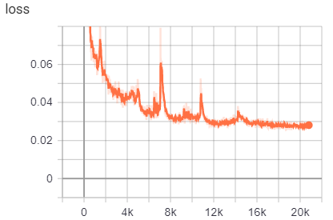

从结果上来看，loss的下降和val_dsc并没有base-line UNet稳定, best validation mean DSC的值也于base-line的无显著提升。

```python
 ## implementaion
    
class ResNeXtUNet(nn.Module):
    def __init__(self, n_classes):
        super().__init__()
        
        self.base_model = resnext50_32x4d(pretrained=True)
        self.base_layers = list(self.base_model.children())
        filters = [4*64, 4*128, 4*256, 4*512]
        
        # Down
        self.encoder0 = nn.Sequential(*self.base_layers[:3])
        self.encoder1 = nn.Sequential(*self.base_layers[4])
        self.encoder2 = nn.Sequential(*self.base_layers[5])
        self.encoder3 = nn.Sequential(*self.base_layers[6])
        self.encoder4 = nn.Sequential(*self.base_layers[7])

        # Up
        self.decoder4 = ResNeXtUNet._DecoderBlock(filters[3], filters[2])
        self.decoder3 = ResNeXtUNet._DecoderBlock(filters[2], filters[1])
        self.decoder2 = ResNeXtUNet._DecoderBlock(filters[1], filters[0])
        self.decoder1 = ResNeXtUNet._DecoderBlock(filters[0], filters[0])

        # final Classifier
        self.last_conv0 = ResNeXtUNet._ConvRelu(256, 128, 3, 1)
        self.last_conv1 = nn.Conv2d(128, n_classes, 3, padding=1)
                       
        
    def forward(self, x):
        # Down
        x = self.encoder0(x)
        enc1 = self.encoder1(x)
        enc2 = self.encoder2(enc1)
        enc3 = self.encoder3(enc2)
        enc4 = self.encoder4(enc3)

        # Up + sc
        dec4 = self.decoder4(enc4) + enc3 #geometric pathway
        dec3 = self.decoder3(dec4) + enc2 #geometric pathway
        dec2 = self.decoder2(dec3) + enc1 #geometric pathway
        dec1 = self.decoder1(dec2)

        # final classifier
        out = self.last_conv0(dec1)
        out = self.last_conv1(out)
        out = torch.sigmoid(out)
        return out

    @staticmethod
    def _ConvRelu(in_channels, out_channels, kernel, padding):
        return  nn.Sequential( nn.Conv2d(in_channels, out_channels, kernel, padding=padding),
                      nn.ReLU(inplace=True))
    @staticmethod
    def _DecoderBlock(in_channels, out_channels):
        return nn.Sequential(ResNeXtUNet._ConvRelu(in_channels, in_channels // 4, 1, 0),
                              nn.ConvTranspose2d(in_channels // 4, in_channels // 4, kernel_size=4, 
                                    stride=2, padding=1, output_padding=0),
                              ResNeXtUNet._ConvRelu(in_channels // 4, out_channels, 1, 0))


```

### 3.3 Feature Pyramid Networks(FPN)[^参考2]

这里参考了图像分割的技巧，由于考虑到有些脑部肿瘤病变可能scale很小，又由于FPN的模型架构特性：即每一层的feature map都有丰富的语义，与UNet的结构有异曲同工之处（个人认为），于是尝试了使用FPN。

```
Best validation mean DSC: 0.898029
```

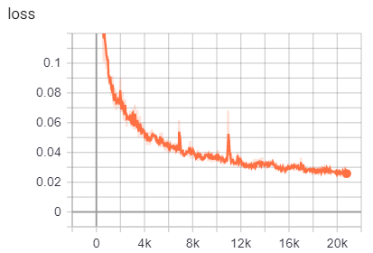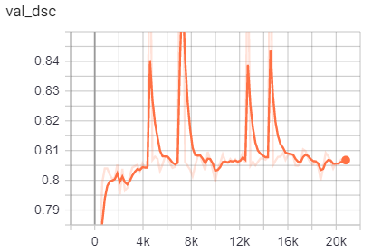

如上图所示，loss下降相对前两者的更加平滑,而val_dsc的变化十分地不稳定。不太清楚原因。

```python
## implementation

class FPN(nn.Module):

    def __init__(self, n_classes=1, pyramid_channels=256, segmentation_channels=256):
        super().__init__()
         
        # Bottom-up layers
        self.encoder1 = UNet._block(3, 64, "enc1")
        self.encoder2 = UNet._block(64, 128, "enc2")
        self.encoder3 = UNet._block(128, 256, "enc3")
        self.encoder4 = UNet._block(256, 512, "enc4")        
        self.encoder5 = UNet._block(512, 1024, "enc5")   
        self.maxpool = nn.MaxPool2d(2)
        
        # Top layer
        self.top = nn.Conv2d(1024, 256, kernel_size=1, stride=1, padding=0)  # Reduce channels

        # Smooth layers
        self.smooth1 = nn.Conv2d(256, 256, kernel_size=3, stride=1, padding=1)
        self.smooth2 = nn.Conv2d(256, 256, kernel_size=3, stride=1, padding=1)
        self.smooth3 = nn.Conv2d(256, 256, kernel_size=3, stride=1, padding=1)

        # Lateral layers
        self.lat1 = nn.Conv2d(512, 256, kernel_size=1, stride=1, padding=0)
        self.lat2 = nn.Conv2d(256, 256, kernel_size=1, stride=1, padding=0)
        self.lat3 = nn.Conv2d(128, 256, kernel_size=1, stride=1, padding=0)
        
        # Segmentation block layers
        self.seg_blocks = nn.ModuleList([
            FPN._SegmentationBlock(pyramid_channels, segmentation_channels, n_upsamples=0),
            FPN._SegmentationBlock(pyramid_channels, segmentation_channels, n_upsamples=1),
            FPN._SegmentationBlock(pyramid_channels, segmentation_channels, n_upsamples=2),
            FPN._SegmentationBlock(pyramid_channels, segmentation_channels, n_upsamples=3),
        ])
        # Last layer
        self.last_conv = nn.Conv2d(256, n_classes, kernel_size=1, stride=1, padding=0)
    
    def _upsample_add(self, x, y):
        _,_,H,W = y.size()
        _upsample = nn.Upsample(size=(H,W), mode='bilinear', align_corners=True) 
        return _upsample(x) + y
        
    def _upsample(self, x, h, w):
        sample = nn.Upsample(size=(h, w), mode='bilinear', align_corners=True)
        return sample(x)
        
    def forward(self, x):
        # Bottom-up
        enc1 = self.maxpool(self.encoder1(x))
        enc2 = self.maxpool(self.encoder2(enc1))
        enc3 = self.maxpool(self.encoder3(enc2))
        enc4 = self.maxpool(self.encoder4(enc3))
        enc5 = self.maxpool(self.encoder5(enc4)) 
        
        # Top-down
        p5 = self.top(enc5) 
        p4 = self._upsample_add(p5, self.lat1(enc4)) 
        p3 = self._upsample_add(p4, self.lat2(enc3))
        p2 = self._upsample_add(p3, self.lat3(enc2)) 
        
        # Smooth
        p4 = self.smooth1(p4)
        p3 = self.smooth2(p3)
        p2 = self.smooth3(p2)
        
        # Segmentation
        _, _, h, w = p2.size()
        feature_pyramid = [seg_block(p) for seg_block, p in zip(self.seg_blocks, [p2, p3, p4, p5])]
        out = self._upsample(self.last_conv(sum(feature_pyramid)), 4 * h, 4 * w)
        out = torch.sigmoid(out)
        return out

    @staticmethod
    def _ConvReluUpsample(in_channels, out_channels, upsample=False):
        modules = [nn.Conv2d(in_channels, out_channels, kernel_size=3, stride=1, padding=1, bias=False),
                  nn.GroupNorm(32, out_channels),
                  nn.ReLU(inplace=True),]
        if upsample:
          modules.append(nn.Upsample(scale_factor=2, mode='bilinear', align_corners=True))
        return nn.Sequential(*modules)

    @staticmethod
    def _SegmentationBlock(in_channels, out_channels, n_upsamples=0):
        blocks = [FPN._ConvReluUpsample(in_channels, out_channels, upsample=bool(n_upsamples))]
        if n_upsamples > 1:
            for _ in range(1, n_upsamples):
                blocks.append(FPN._ConvReluUpsample(out_channels, out_channels, upsample=True))
        return nn.Sequential(*blocks)

```


## 四. 替换Loss function

### 4.1 使用IoULoss替换Dice Loss

IoU和dice coefficient都时image segmentation中的常用指标。

```
Best validation mean DSC: 0.911393
```

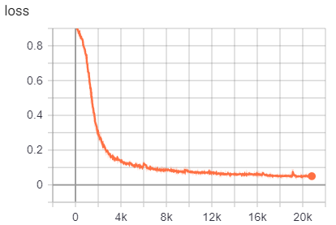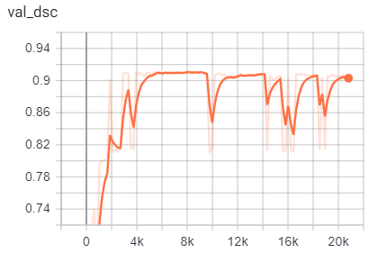

感觉这里与使用Dice Loss的变化不是很大，毕竟原公式两者也并没有相差很多。

```python
## implementation

class IoULoss(nn.Module):
    def __init__(self, weight=None, size_average=True):
        super(IoULoss, self).__init__()
        self.smooth = 1.0

    def forward(self, y_pred, y_true):    
        assert y_pred.size() == y_true.size()
        y_pred = y_pred[:, 0].contiguous().view(-1)
        y_true = y_true[:, 0].contiguous().view(-1)
        intersection = (y_pred * y_true).sum()
        total = (y_pred + y_true).sum()
        union = total - intersection 
        IoU = (intersection + self.smooth)/(union + self.smooth)
        return 1. - IoU
```

### 4.2 使用Binary Cross Entropy Loss 替换Dice Loss

由于是一个semantic segmentation的问题，即pixel level的classification，可以使用Binary Cross Entropy来计算Loss函数。

由于数据集本身是biased（大多数pixel是属于无病变的，仅有小部分是病变的），因此这里进行随机采样，取了约50%样本计算loss。

```
Best validation mean DSC: 0.905591
```

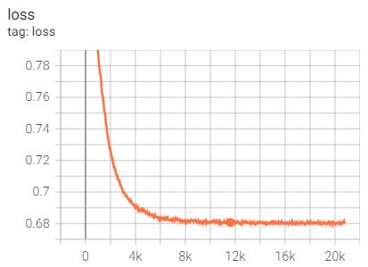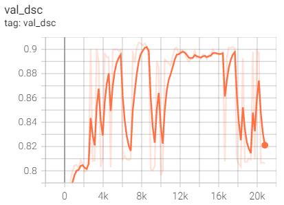

如上图所示，loss的确是在持续下降，但最低值也徘徊在0.68左右。val_dsc的值振荡，不是很稳定。不过总体的mean dsc值与原模型不误太大的差距。loss改变对整体效果的影响较小。

```python
# implementation

class BCELoss(nn.Module):
    def __init__(self):
      super(BCELoss, self).__init__()
      self.seed = 42
  
    def forward(self, y_pred, y_true):
        assert y_pred.size() == y_true.size()
        y_pred = torch.sigmoid(y_pred)
        y_pred = y_pred[:, 0].contiguous().view(-1)
        y_true = y_true[:, 0].contiguous().view(-1)
        # sampling since the dataset is biased
        random.seed(self.seed)
        indexes = random.sample([i for i in range(len(y_pred))], k=int(0.5*len(y_pred)))
        y_pred = y_pred[indexes]
        y_true = y_true[indexes]
        return -(y_pred.log()*y_true + (1-y_true)*(1-y_pred).log()).mean()
```


## 五. 总结

总体来说虽然上述的四个模型的dsc相差不是很显著，但还是经典UNet的效果相对更稳定。

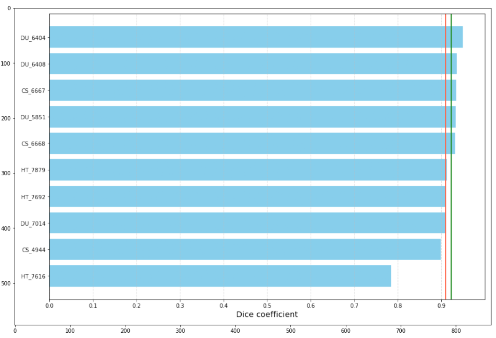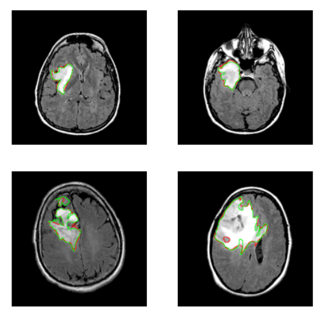

题外话，其实可以把几个模型预测的mask图像叠加地将outline画出来看，对比会更加明显（由于时间关系，这里先放个坑嘿）。


[^参考1]: https://www.kaggle.com/code/bonhart/brain-mri-data-visualization-unet-fpn
[^参考2]: https://www.kaggle.com/code/bonhart/brain-mri-data-visualization-unet-fpn
