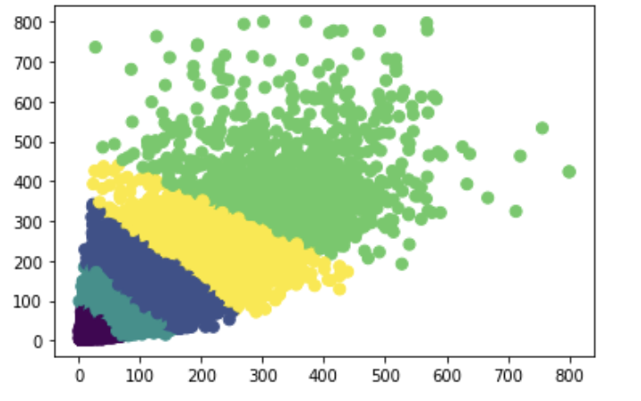

# 实验五报告

## 一. 实验要求

本次案例将使用深度学习技术来完成城市交通场景下的目标检测任务，案例所使用的数据集由滴滴出行提供，基于 D2-City 大规模行车记录视频数据集[1]， 经过视频抽帧等预处理步骤得到。数据集共包含 12,000 张图像，每张图像的大 小为 1080×1920 或 720×1280，已划分为训练集(10,000 张)、验证集(1,000 张)、 测试集(1,000 张)，其中训练集和验证集提供了检测标签，测试集仅提供图像， 用于提交后测试模型效果。本数据集共包含 12 个待检测的物体类别，包括小汽 车、公交车、自行车、行人等。本任务的目标是在给定的交通场景图像中，尽可能完整、准确地检测出所有要求的物体。


## 二. Faster R-CNN baseline

faster r-cnn base line模型就是本次案例给出的最初模， 即`mmdetection/configs/_base_/models/faster_rcnn_r50_fpn.py`的配置，无任何改动。

训练后在验证集上的结果 ( 这里给出12个epoch的原因是方便之后的比较，因为有些模型没有训练满12个epoch )：

| epoch | bbox_mAP | bbox_mAP_50 | bbox_mAP_75 | bbox_mAP_s | bbox_mAP_m | bbox_mAP_l |
| ----- | -------- | ----------- | ----------- | ---------- | ---------- | ---------- |
| 1     | 0.160    | 0.290       | 0.157       | 0.062      | 0.172      | 0.276      |
| 2     | 0.192    | 0.351       | 0.186       | 0.086      | 0.211      | 0.318      |
| 3     | 0.208    | 0.372       | 0.202       | 0.085      | 0.225      | 0.332      |
| 4     | 0.216    | 0.374       | 0.208       | 0.091      | 0.249      | 0.327      |
| 5     | 0.223    | 0.387       | 0.221       | 0.107      | 0.243      | 0.361      |
| 6     | 0.231    | 0.415       | 0.228       | 0.093      | 0.259      | 0.353      |
| 7     | 0.229    | 0.417       | 0.214       | 0.089      | 0.256      | 0.365      |
| 8     | 0.230    | 0.403       | 0.228       | 0.099      | 0.251      | 0.367      |
| 9     | 0.277    | 0.463       | 0.286       | 0.120      | 0.306      | 0.432      |
| 10    | 0.282    | 0.471       | 0.284       | 0.125      | 0.308      | 0.437      |
| 11    | 0.278    | 0.471       | 0.279       | 0.127      | 0.305      | 0.430      |
| 12    | 0.2830   | 0.4740      | 0.2870      | 0.1260     | 0.3110     | 0.4370     |

从结果可以看出base line模型对与体积较小的物体的检测能力相对于体积较大的物体的检测能力更差一些。

个人认为可能的原因：验证集的图像物体较密集，而训练集的图像物体较稀疏，因此有bias导致模型无法检测，但经查看训练集的json文件和验证集的json文件中的`iscrowd` 发现，其实不然， 大多数的图像中的物体密集程度皆为 `iscrowd=0`。而且模型设置中有使用到fpn，理论上说应该各个scale上的预测效果不会有太大的出入（不太清楚其原因）。


## 三. anchor设置调整

### 3.1 naive anchor box调整

prior anchor box的设置对于bounding box regression有很大的影响。一开始没有什么策略，就只是增加了不同的scale和base box 大小，想着多一点可能效果regression有增益。

```python
## faster_rcnn_r50_fpn_customized_anchor.py的rpn head中anchor_generator的设置
anchor_generator=dict(
    type='AnchorGenerator',
    scales=[4,8,16],
    ratios=[0.2, 0.5, 1.0, 2.0, 4.0],
    strides=[4, 8, 16, 32, 64]),
```

这里是一轮epoch后在验证集上的结果（ 因为不知道什么原因，服务器突然断链了）：

| bbox_mAP | bbox_mAP_50 | bbox_mAP_75 | bbox_mAP_s | bbox_mAP_m | bbox_mAP_l |
| -------- | ----------- | ----------- | ---------- | ---------- | ---------- |
| 0.1430   | 0.2550      | 0.1440      | 0.0590     | 0.1490     | 0.2420     |

比base line的要差了`10.6%` , 不是很明白为什么增加了anchor boxes的选择，反而效果下降了。感觉可能是取的点不对，也有可能是训练前期不太稳定原因。


### 3.2 使用kmeans分析anchor box的分布情况

聚类后的效果：



其中, 横坐标是`bbox` resize之后的`width 而纵坐标是`bbox` resize之后的`height`。 对于这张图的分布，我怀疑可能resize计算存在问题，因为resize之后max bbox width可以达到800，max bbox height可以达到799.99，但我也不知道那错了（哭）。

经过聚类分析，可以看到`ratio`在的取值可以约为`[0.48975989] [1.4822957 ] [1.04217371] [2.3119141 ] [4.00007993]`这5 个取值。而base box size可以调整程相应的大小。

但是由于这部分是我在具体地阅读了yolo选择anchor box的方法后，才打算在faster rcnn上试试的，时间太赶，没有时间训练，只是得到anchor box的分布，并用kmeans聚出5类（具体代码可以看`train1.ipynb`文件）。


## 四. RegNet替换ResNet50 backbone

这里将ResNet50替换成了RegNet。

```python
## faster_rcnn_regnet_fpn.py中backbone的设置
backbone=dict(
        type='RegNet',
        arch='regnetx_3.2gf',
        out_indices=(0,1,2,3),
        frozen_stages=1,
        norm_cfg=dict(type='BN', requires_grad=True),
        norm_eval=True,
        style='pytorch',
        init_cfg=dict(
            type='Pretrained', checkpoint='open-mmlab://regnetx_3.2gf')),
```

经过12个epoch的训练后在验证集上的结果：

| bbox_mAP | bbox_mAP_50 | bbox_mAP_75 | bbox_mAP_s | bbox_mAP_m | bbox_mAP_l |
| -------- | ----------- | ----------- | ---------- | ---------- | ---------- |
| 0.2830   | 0.4920      | 0.2960      | 0.1260     | 0.3240     | 0.4460     |

与base line相比整体上有了`3.88%`的提升。`regnet`对于feature extraction的执行力似乎比`resnet50`更好一点。`mmdetection/mmdet/models/backbones` 这里还可以尝试例如有`res2net`。


## 五. 训练图像数据增强

由于本案例的任务是对行驶中的前方路况物体进行预测，因此根据事实图像采样是很受天气、光照等影响的，有时阳光国强可能曝光过度，采取出来的图片的与阴天不同。考虑到这种情况，便对本次数据集的图像添加了`BrighnessTransform`, `ConstrastTransform`.

```python
## didi_detection_aug.py
train_pipeline = [
    dict(type='LoadImageFromFile'),
    dict(type='LoadAnnotations', with_bbox=True),
    dict(type='Resize', img_scale=(1333, 800), keep_ratio=True),
    dict(type='RandomFlip', flip_ratio=0.5),
    dict(type='BrightnessTransform',level=7),
    dict(type='ContrastTransform',level=7),
    dict(type='Normalize', **img_norm_cfg),
    dict(type='Pad', size_divisor=32),
    dict(type='DefaultFormatBundle'),
    dict(type='Collect', keys=['img', 'gt_bboxes', 'gt_labels']),
]
```

这个部分只训练了3个完整的epoch，以下是3个epoch后在验证集上的结果：

| bbox_mAP | bbox_mAP_50 | bbox_mAP_75 | bbox_mAP_s | bbox_mAP_m | bbox_mAP_l |
| -------- | ----------- | ----------- | ---------- | ---------- | ---------- |
| 0.1780   | 0.3130      | 0.1770      | 0.0660     | 0.1930     | 0.2930     |

与base line的第三个epoch相比性能有所退步，bbox_mAP下降了约`14.4%`(哭)。我觉得是因为transformation仅在train pipeline上做了，并没有对test pipeline进行相应调整，导致给模型带来了很多噪音的原因。


## 六. Cascade R-CNN

具体配置代码在`cascade_rcnn_r50_fpn_1x_didi.py`中。

这个部分的训练仅进行了5个完整的epoch，以下是5个epoch后在验证集上的结果：

| bbox_mAP | bbox_mAP_50 | bbox_mAP_75 | bbox_mAP_s | bbox_mAP_m | bbox_mAP_l |
| -------- | ----------- | ----------- | ---------- | ---------- | ---------- |
| 0.2480   | 0.414       | 0.252       | 0.1180     | 0.271      | 0.3870     |

与base line的第5个epoch相比提升了约`11.2%`。cascade r-cnn模型的中心思想类似于boostraping，与之不同的是，它在training的每次迭代中都选出上次迭代中离ground truth近的false postive样本，并对其进行修正，使得最终的训练效果得以增强。


## 七. YOLOv3

具体配置代码在`yolov3_d53_mstrain-608_273e_didi.py`中。

以下是12个epoch后在验证集上的结果：

| bbox_mAP | bbox_mAP_50 | bbox_mAP_75 | bbox_mAP_s | bbox_mAP_m | bbox_mAP_l |
| -------- | ----------- | ----------- | ---------- | ---------- | ---------- |
| 0.166    | 0.339       | 0.146       | 0.074      | 0.176      | 0.267      |

yolo作为one stage的模型精准度确实没有two stage的好。但胜于它的inference时间比two stage的快很多。这里yolo做1000张验证集inference所用时间是64s，而base line faster r-cnn所需的时间为82s，快了近`22%`。


## 八. DETR

具体配置代码在`detr_r50_8x2_150e_didi.py`中。

这个部分可能是我的模型配置有问题，训练下来所有mAP的值皆为`0`, 后续有时间再做调整。


## 九. 总结

对于本次实验的模型优化程度非常小，几乎没有提升。（本次所有尝试代码都在`train1.ipynb` 和`train2.ipynb` 中）

由于本人最近在期末考试，完成作业的时间有点仓促orz，因此本次实验还有很多地方没有仔细研究过，包括论文的阅读，各种模型的参数调整和mmdetection提供的工具的研究， 希望以后有时间再更系统地学习一下。


