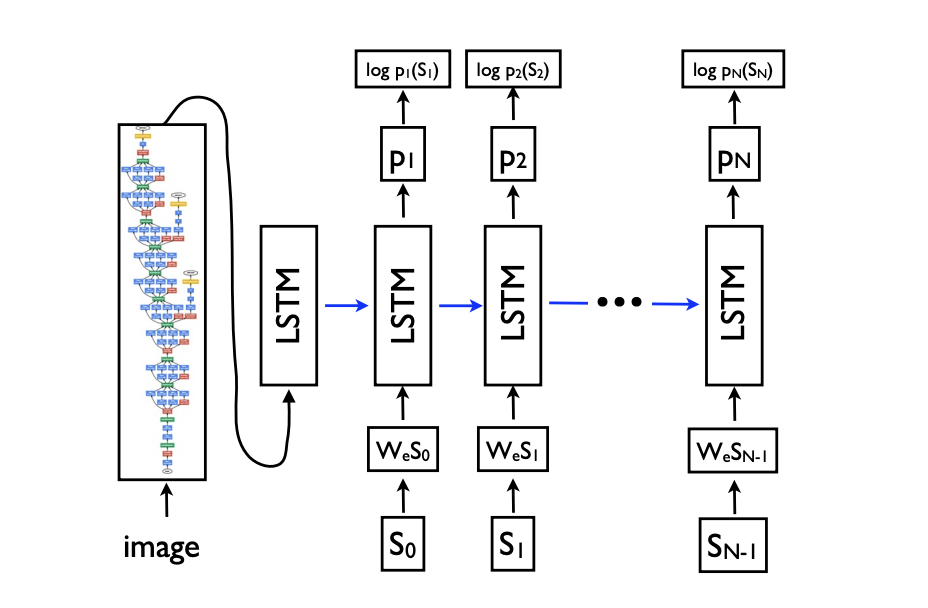
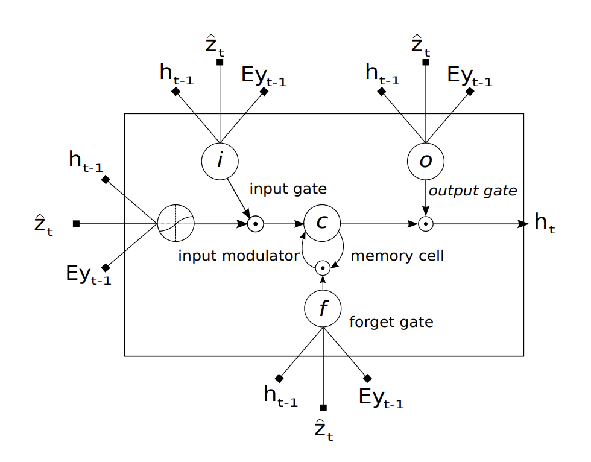
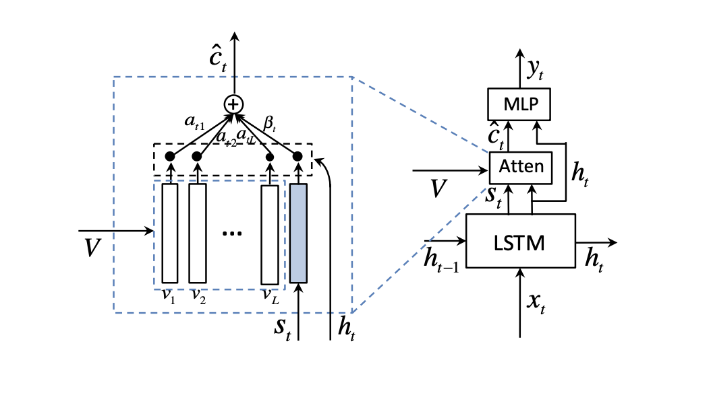
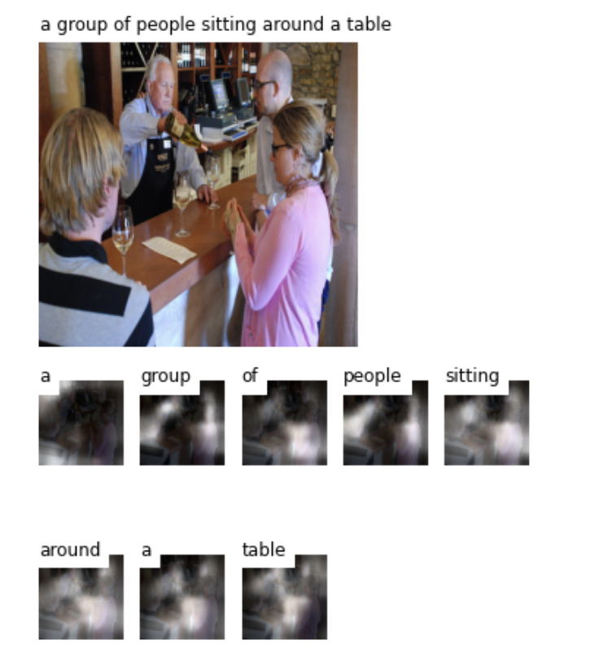

# 实验六报告

## 一. 实验概述与要求

本次案例将使用深度学习技术来完成图像自然语言描述生成任务，输入一张图片，模型会给出关于图片内容的语言描述。本案例使用 coco2014 数据集[1]，包含 82,783 张训练图片，40,504 张验证图片，40,775 张测试图片。案例使用 Andrej Karpathy[2]提供的数据集划分方式和图片标注信息，案例已提供数据处理的脚本， 只需下载数据集和划分方式即可。

图像自然语言描述生成任务一般采用 Encoder-Decoder 的网络结构，Encoder 采用 CNN 结构，对输入图片进行编码，Decoder 采用 RNN 结构，利用 Encoder 编码信息，逐个单词的解码文字描述输出。模型评估指标采用 BLEU 分数[3]，用来衡量预测和标签两句话的一致程度，具体计算方法可自行学习，案例已提供计算代码。


## 二. DecoderWithRNN

### 2.1 模型实现

根据*Show and Tell: A Neural Image Caption Generator[https://arxiv.org/pdf/1411.4555.pdf]*这篇文章实现的Decoder部分。

其主要结构就是一个CNN模型来提取图像特征，并将提出来的特征图像，大小为( batch_size, 14, 14, 2048 )的`encoder_out`喂给 LSTM模型；同时，将`encoded_caption`（每张图对应的文字描述）传给decoder中的embedding layer（word2vector），将它转化为一个向量后用它来初始化LSTM模型（如Fig1所示）。

代码框架中的`one_step`函数意指每一个时间步`t`时LSTM模型进行的一步计算。每一步都会generate一个word，而步数不超过最大输入caption长度，因此LSTM的迭代一定会终止。

此外，由于本代码框架已经在`train`函数中做好了softmax求probability，因此在`forward`函数中只需求出logits即可。



​																				*Fig1. 原论文中截取的模型框架结构*

#### 2.1.1 代码

```python
class DecoderWithRNN(nn.Module):
    def __init__(self, cfg, encoder_dim=14*14*2048):
        super(DecoderWithRNN, self).__init__()
        self.encoder_dim = encoder_dim
        self.decoder_dim = cfg['decoder_dim']
        self.embed_dim = cfg['embed_dim']
        self.vocab_size = cfg['vocab_size']
        self.dropout = cfg['dropout']
        self.device = cfg['device']

        self.embedding = nn.Embedding(num_embeddings=self.vocab_size, embedding_dim=self.embed_dim)
        self.bn = nn.BatchNorm1d(num_features=self.decoder_dim)
        self.init = nn.Linear(in_features=self.encoder_dim,out_features=self.decoder_dim)
        self.decode_step = nn.LSTMCell(input_size=self.decoder_dim, hidden_size=self.decoder_dim, bias=True)
        self.fc = nn.Linear(in_features=self.decoder_dim,out_features=self.vocab_size)
        self.dropout = nn.Dropout(self.dropout)
        
        # initialize some layers with the uniform distribution
        self.embedding.weight.data.uniform_(-0.1, 0.1)
        self.fc.bias.data.fill_(0)
        self.fc.weight.data.uniform_(-0.1, 0.1)
```

```python
    def forward(self, encoder_out, encoded_captions, caption_lengths):
        batch_size = encoder_out.size(0)
        encoder_out = encoder_out.reshape(batch_size, -1)
        vocab_size = self.vocab_size
        
        # Sort input data by decreasing lengths;
        caption_lengths, sort_ind = caption_lengths.squeeze(1).sort(dim=0, descending=True)
        encoder_out = encoder_out[sort_ind]
        encoded_captions = encoded_captions[sort_ind]
        
        # Embedding
        # the order of embeddings are the same as the sorted encoded captions
        embeddings = self.embedding(encoded_captions) # (batch_size=32, max_caption_length=52, embed_dim=512)
        # We won't decode at the <end> position, since we've finished generating as soon as we generate <end>
        # So, decoding lengths are actual lengths - 1
        decode_lengths = (caption_lengths - 1).tolist()
        # Create tensors to hold word predicion scores
        predictions = torch.zeros(batch_size, max(decode_lengths), vocab_size).to(self.device)
        # Initialize LSTM state
        init_input = self.bn(self.init(encoder_out))
        h, c = self.decode_step(init_input)  # (batch_size_t, decoder_dim)
        # t denotes the t-th time step or the t-th word in a generating caption
        for t in range(max(decode_lengths)):  
          count = sum([1 if l > t else 0 for l in decode_lengths])
          # we can do the slicing here because embeddings and decode_lengths are both sorted in descending order
          preds, h, c = self.one_step(embeddings[:count,t,:], h[:count], c[:count])
          predictions[:count,t,:] = preds
        return predictions, encoded_captions, decode_lengths, sort_ind
      
    def one_step(self, embeddings, h, c):
        h, c = self.decode_step(embeddings, (h,c))
        preds = self.fc(self.dropout(h))
        return preds, h, c
```

### 2.2 模型调参

这里在原有的DecoderWithRNN上，尝试调试了`embed_dim`和`decoder_dim` 。将两者从512调至了1024。

经过10个epoch后再validation set上的BLEU-4 score为$22.4876$%, 与之相比原模型dimension为512时10个epoch后在validation set上的BLEU-4 score为$21.8933$%， 有所提升。


## 三. DecoderWithAttention

### 3.1 模型实现

此部分代码实现依据了*Show, Attend and Tell: Neural Image Caption Generation with Visual Attention[https://arxiv.org/pdf/1502.03044.pdf]* 这篇文章。

与简单的RNN不同的是，对于每一步LSTM的计算，这里输入的不仅仅是（word）embeddings，同时也concatenate with从`encoder_out`中提取出后通过attention模型提取出的(spatial) context vector `z`，来表示预测当当前第`t`个word时所需关注的图片特征。（如Fig2所示）

其中，比较大的改动有以下两点：

1. 在LSTM初始化时采用了`encoder_out`的均值。

   $c_0 = f_{init,c}(\frac{1}{L}\sum_i^L a_i)$, $h_0 = f_{init, h}(\frac{1}{L}\sum_i^L a_i)$, where $a_i$ is encoder_out

2. 在本实验的实现中，采用了文章中所提的`soft attention`机制。以下公式来自于原论文。

   $\phi({a_i, \{ \alpha_i\}}) = \beta \sum_i^L \alpha_i a_i$, where $\phi$ is the attention mechanism, $\beta_t = \sigma(f_{\beta}(h_{t-1}))$ and $\alpha_i$ is the parameter controlling each `encoder_out` vector.



​																		*Fig2. 原论文中截取的lstm部分模型框架结构*

#### 3.1.1 代码

```python
class Attention(nn.Module):
    def __init__(self, encoder_dim, decoder_dim, attention_dim):
        super(Attention, self).__init__()
        self.f_att1 = nn.Linear(encoder_dim, attention_dim)
        self.f_att2 = nn.Linear(decoder_dim, attention_dim)
        self.f_att3 = nn.Linear(attention_dim,1)
        
    def forward(self, encoder_out, decoder_hidden):
        att1 = self.f_att1(encoder_out)
        att2 = self.f_att2(decoder_hidden)
        e = self.f_att3(F.relu(att1 + att2.unsqueeze(1))).squeeze(2)
        alpha = F.softmax(e)
        # z - the context vector
        z = (encoder_out * alpha.unsqueeze(2)).sum(dim=1)          # soft attention is used
        return z, alpha
```

```python
class DecoderWithAttention(nn.Module):
    def __init__(self, cfg, encoder_dim=2048):
        super(DecoderWithAttention, self).__init__()
        self.encoder_dim = encoder_dim
        self.decoder_dim = cfg['decoder_dim']
        self.attention_dim = cfg['attention_dim']
        self.embed_dim = cfg['embed_dim']
        self.vocab_size = cfg['vocab_size']
        self.dropout = cfg['dropout']
        self.device = cfg['device']
        
        self.attention = Attention(encoder_dim, self.decoder_dim, self.attention_dim)
        self.embedding = nn.Embedding(self.vocab_size, self.embed_dim)
        self.dropout = nn.Dropout(p=self.dropout)
        self.decode_step = nn.LSTMCell(self.embed_dim + self.encoder_dim, self.decoder_dim, bias=True)
        self.init_h = nn.Linear(self.encoder_dim, self.decoder_dim)
        self.init_c = nn.Linear(self.encoder_dim, self.decoder_dim)
        self.f_beta = nn.Linear(self.decoder_dim, self.encoder_dim)
        self.fc = nn.Linear(self.decoder_dim, self.vocab_size)
        # initialize some layers with the uniform distribution
        self.embedding.weight.data.uniform_(-0.1, 0.1)
        self.fc.bias.data.fill_(0)
        self.fc.weight.data.uniform_(-0.1, 0.1)

    def forward(self, encoder_out, encoded_captions, caption_lengths):
        batch_size = encoder_out.size(0)
        encoder_dim = encoder_out.size(-1)
        vocab_size = self.vocab_size

        # Flatten image
        encoder_out = encoder_out.view(batch_size, -1, encoder_dim)  # (batch_size, num_pixels, encoder_dim)
        num_pixels = encoder_out.size(1)

        # Sort input data by decreasing lengths;
        caption_lengths, sort_ind = caption_lengths.squeeze(1).sort(dim=0, descending=True)
        encoder_out = encoder_out[sort_ind]
        encoded_captions = encoded_captions[sort_ind]

        # Embedding
        embeddings = self.embedding(encoded_captions)  # (batch_size, max_caption_length, embed_dim)

        # We won't decode at the <end> position, since we've finished generating as soon as we generate <end>
        # So, decoding lengths are actual lengths - 1
        decode_lengths = (caption_lengths - 1).tolist()

        # Create tensors to hold word predicion scores and alphas
        predictions = torch.zeros(batch_size, max(decode_lengths), vocab_size).to(self.device)
        alphas = torch.zeros(batch_size, max(decode_lengths), num_pixels).to(self.device)

        # Initialize LSTM state
        mean_encoder_out = encoder_out.mean(dim=1)
        h = self.init_h(mean_encoder_out)    # (batch_size, decoder_dim)
        c = self.init_c(mean_encoder_out)

        for t in range(max(decode_lengths)):
          count = sum([1 if l > t else 0 for l in decode_lengths])
          preds, alpha, h, c = self.one_step(embeddings[:count, t, :], encoder_out[:count], h[:count], c[:count])
          predictions[:count,t,:] = preds
          alphas[:count,t,:] = alpha
        return predictions, encoded_captions, decode_lengths, alphas, sort_ind

    def one_step(self, embeddings, encoder_out, h, c):
        z, alpha = self.attention(encoder_out, h)
        beta = F.sigmoid(self.f_beta(h))
        z = beta * z
        h, c = self.decode_step(torch.cat([embeddings,z], dim=1),(h,c))
        preds = self.fc(self.dropout(h))
        return preds, alpha, h, c
```

### 3.2 模型调参

因为感觉模型的train的BLEU score比较低，过拟合的可能性比较小，因此这里调整了一下以上模型的正则参数`alpha_c`, 从原先的1.0下调至0.1。

最终10个epoch后再validation set上的BLEU score为$22.9554$%, 而`alpha_c=1`的attention模型10个epoch后在validation set BLEU score表现为$23.1586$%, 说明还是原参数的效果更好，此模型存在过拟合。


## 四. DecoderWithAdaptiveAttention

### 4.1 模型实现

此部分代码实现依据了*Knowing When to Look: Adaptive Attention via A Visual Sentinel for Image Captioning[https://arxiv.org/pdf/1612.01887.pdf]* 这篇文章, 同时adaptive attention代码还参考了[https://github.com/fawazsammani/knowing-when-to-look-adaptive-attention]。

adaptive attention模型在原attention模型的基础上修改了attention的位置， i.e. 之前的attention模型是在lstm decode step之前，将attention提取出来的spatial image特征喂给lstm模型来进行decode， 然而在adaptive attention中，顺序反过来了，将lstm的输出`s_t`, 即原文中的`visual sentinel`，喂给attention模型，与此同时，还添加了global image features。（如Fig3所示）

其中，

1. visual sentinel的计算方式为：$g_t = \sigma(W_x x_t + W_h h_{t-1})$,  $s_t  = g_t \odot tanh (mt) $
2. context vecotr的计算公式： $\hat{c_t} = \beta_t s_t + (1-\beta_t) c_t$
3. attention的定义公式为：$\hat{\alpha_t} = softmax([z_t; w_h^T tanh(W_s s_t + W_g h_t)])$



​																		*Fig3.原论文中截取的decoder部分模型框架结构*

```python
class EncoderWithGlobalFeature(nn.Module):
    def __init__(self, cfg, encoded_image_size=7):
        super(EncoderWithGlobalFeature,self).__init__()

        self.enc_image_size = encoded_image_size
        resnet = torchvision.models.resnet101(pretrained = True)
        modules = list(resnet.children())[:-2]
        self.resnet = nn.Sequential(*modules) 
        self.adaptive_pool = nn.AdaptiveAvgPool2d((7,7))

        self.fine_tune(fine_tune=True)
    
    def forward(self,images):
        out = self.resnet(images)         # (batch_size,2048,7,7)
        out = self.adaptive_pool(out)
        batch_size = out.size(0)
        features = out.size(1)
        num_pixels = out.size(2) * out.size(3)
        # Get the global features of the image
        global_features = out.view(batch_size, num_pixels, features).mean(1)   # (batch_size, 2048)
        enc_image = out.permute(0, 2, 3, 1)  #  (batch_size,7,7,2048)
        enc_image = enc_image.view(batch_size,num_pixels,features)          # (batch_size,num_pixels,2048)
        return enc_image, global_features

class AdaptiveAttention(nn.Module):
    def __init__(self, decoder_dim, attention_dim):
        super(AdaptiveAttention,self).__init__()
        self.sen_transform = nn.Linear(decoder_dim, decoder_dim)  
        self.sen_att = nn.Linear(decoder_dim, decoder_dim)
        self.h_transform = nn.Linear(decoder_dim, decoder_dim)   
        self.h_att = nn.Linear(decoder_dim, decoder_dim)
        self.v_att = nn.Linear(decoder_dim, attention_dim)
        self.alphas = nn.Linear(attention_dim, 1)
        self.context_hidden = nn.Linear(decoder_dim, decoder_dim)

    def forward(self, spatial_image, decoder_out, s_t):
        num_pixels = spatial_image.size(1)
        visual_attn = self.v_att(spatial_image)           	# (batch_size,num_pixels,att_dim)
        sentinel = F.relu(self.sen_transform(s_t))    		 	# (batch_size, decoder_dim)
        sentinel_attn = self.sen_att(sentinel)     					# (batch_size,attention_dim)

        hidden = F.tanh(self.h_transform(decoder_out))      # (batch_size,decoder_size)
        hidden_attn = self.h_att(hidden)              		  # (batch_size,attention_dim)

        hidden_resized = hidden_attn.unsqueeze(1).expand(hidden_attn.size(0), num_pixels + 1, hidden_attn.size(1))

        concat_features = torch.cat([spatial_image, sentinel.unsqueeze(1)], dim = 1)   # (batch_size, num_pixels+1, decoder_dim)
        attended_features = torch.cat([visual_attn, sentinel_attn.unsqueeze(1)], dim = 1) # (batch_size, num_pixels+1, attention_dim)

        attention = F.tanh(attended_features + hidden_resized) # (batch_size, num_pixels+1, attention_dim)
        
        alpha = self.alphas(attention).squeeze(2)                  				 # (batch_size, num_pixels+1)
        att_weights = F.softmax(alpha, dim=1)                             # (batch_size, num_pixels+1)

        context = (concat_features * att_weights.unsqueeze(2)).sum(dim=1) # (batch_size, decoder_dim)     
        beta_value = att_weights[:,-1].unsqueeze(1)                       # (batch_size, 1)
        out_l = F.tanh(self.context_hidden(context + hidden))
        return out_l, att_weights, beta_value


class DecoderWithAdaptiveAttention(nn.Module):
    def __init__(self, cfg, encoder_dim=2048):
        super(DecoderWithAdaptiveAttention,self).__init__()

        self.encoder_dim = encoder_dim
        self.decoder_dim = cfg['decoder_dim']
        self.attention_dim = cfg['attention_dim']
        self.embed_dim = cfg['embed_dim']
        self.vocab_size = cfg['vocab_size']
        self.dropout = cfg['dropout']
        self.device = cfg['device']

        self.fc = nn.Linear(self.decoder_dim, self.vocab_size)

        self.enc_image_transform = nn.Linear(self.encoder_dim, self.decoder_dim)
        self.global_feature_transform = nn.Linear(self.encoder_dim, self.embed_dim)
        
        self.init_h = nn.Linear(self.encoder_dim, self.decoder_dim)
        self.init_c = nn.Linear(self.encoder_dim, self.decoder_dim)

        self.x_weight = nn.Linear(self.embed_dim*2, self.decoder_dim)
        self.h_weight = nn.Linear(self.decoder_dim, self.decoder_dim)
        
        self.decode_step = nn.LSTMCell(self.embed_dim*2, self.decoder_dim)
        self.adaptive_attention = AdaptiveAttention(self.decoder_dim, self.attention_dim)
        self.embedding = nn.Embedding(self.vocab_size, self.embed_dim)  
        self.dropout = nn.Dropout(p=self.dropout)

        self.fc.weight.data.uniform_(-0.1, 0.1)
        self.fc.bias.data.fill_(0)
        self.embedding.weight.data.uniform_(-0.1, 0.1)

    
    def forward(self, encoder_out, global_features, encoded_captions, caption_lengths):
        # to transform the encoder_out and global features to the desired dimension
        spatial_image = F.relu(self.enc_image_transform(encoder_out)) # (batch_size, 512)
        global_features = F.relu(self.global_feature_transform(global_features)) #(batch_size, 49, 512)
        batch_size = encoder_out.size(0)
        encoder_dim = encoder_out.size(-1)
        vocab_size = self.vocab_size

        # Flatten image
        encoder_out = encoder_out.reshape(batch_size, -1, encoder_dim) # (batch_size, num_pixels, encoder_dim) 
        num_pixels = encoder_out.size(1)

        # sort the data by decreasing lengths
        caption_lengths, sort_ind = caption_lengths.squeeze(1).sort(dim=0, descending=True)
        encoder_out = encoder_out[sort_ind]  
        encoded_captions = encoded_captions[sort_ind]    
        spatial_image = spatial_image[sort_ind]          
        global_image = global_features[sort_ind]                 

        # Embedding
        embeddings = self.embedding(encoded_captions)     # (batch_size, max_caption_length, embed_dim)
        decode_lengths = (caption_lengths - 1).tolist()

        # create tensors to hold word predicion scores,alphas and betas
        predictions = torch.zeros(batch_size, max(decode_lengths), self.vocab_size).to(self.device)
        alphas = torch.zeros(batch_size, max(decode_lengths), num_pixels+1).to(self.device)
        betas = torch.zeros(batch_size, max(decode_lengths),1).to(self.device) 
        
        # Initialize the LSTM state
        mean_encoder_out = encoder_out.mean(dim=1)
        h = self.init_h(mean_encoder_out)
        c = self.init_c(mean_encoder_out)

        # Concatenate the embeddings and global image features for input to LSTM 
        global_features = global_features.unsqueeze(1).expand_as(embeddings)
        x = torch.cat((embeddings,global_features), dim = 2)

        for t in range(max(decode_lengths)):
            count = sum([1 if l > t else 0 for l in decode_lengths])
            h, c, alpha, beta, preds = self.one_step(x[:count,t,:],spatial_image[:count], h[:count], c[:count])
            predictions[:count,t,:] = preds
            alphas[:count,t,:] = alpha
            betas[:count,t,:] = beta
            
        return predictions, alphas, betas, encoded_captions, decode_lengths, sort_ind 

    def one_step(self, x, spatial_image, h, c):
        h_t, c_t = self.decode_step(x,(h,c))
        sentinal_gate = F.sigmoid(self.x_weight(x) + self.h_weight(h))
        s_t = sentinal_gate*F.tanh(c_t)
        context, alpha, beta = self.adaptive_attention(spatial_image, h_t, s_t)
        preds = self.fc(self.dropout(context + h_t))
        return h_t, c_t, alpha, beta, preds

```


## 五. 测试结果

### 5.1 测试集BLEU score

| DecoderWithRNN | DecoderWithAttention |
| -------------- | -------------------- |
| $26.5919 \%$   | $27.8203\%$          |

(这里本来打算同时对比一下adaptive attention的，但不知什么原因导致无法load EncoderWithGlobalFeature模型)

对比分析模型结果：

从上表中的不难看出attention机制对原模型的BLEU score的提升还是显著的，毕竟可以localize每个单词所对应的图像特征。

### 5.2 单张图效果展示

左图为DecoderWithRNN运行所获得的结果，而右图为DecoderWithAttention所获得的结果。从右图中可以直观地观察到不同的caption word对应的图片信息的位置是不同的。



​											*Fig4.模型效果展示*


