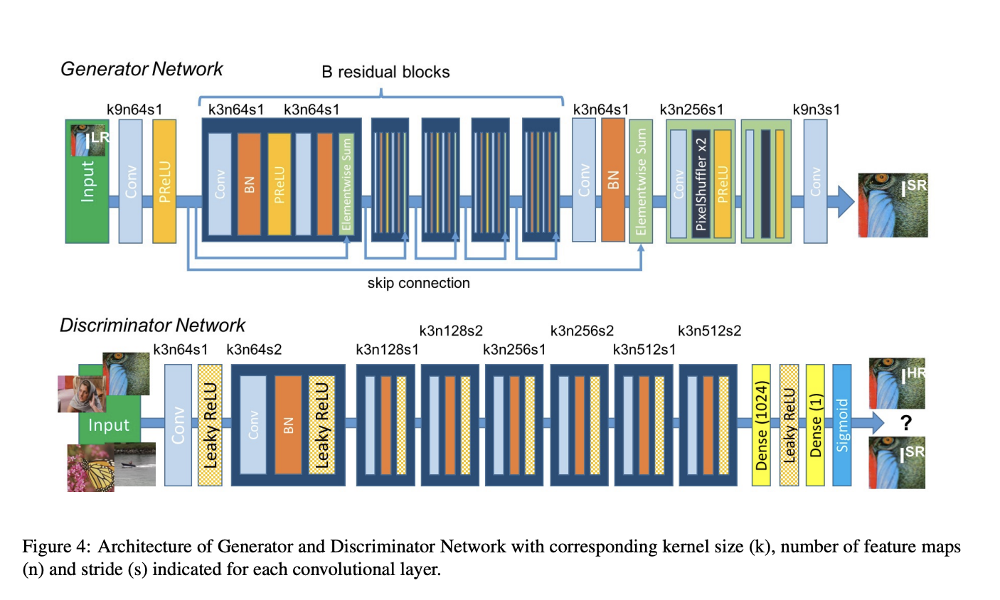

# 实验七报告

## 一. 实验概述

本次案例将使用生成对抗网络来实现 4 倍图像超分辨任务，输入一张低分辨率图像，生成器会生成一张 4 倍超分辨率的图像，如图 1 所示。生成对抗网络选 用 SRGAN 结构[1]。本案例训练集使用 DIV2K 数据集[2]，包含有 800 张 2K 左右 高分辨率的图像和 800 张对应的低分辨率图像;测试集使用 DIV2K 验证集[2]、 Set5、Set14、B100、Urban100 五个数据集，分别包括高分辨率图像和对应的低 分辨率图像。训练集和测试集中的所有低分辨图像都是由高分辨率图像下采样得 到，下采样方法为使用 Matlab 中的 resize 函数，scale factor 为 0.25，其余为默认 参数(双三次插值)。

## 二. 模型实现

模型结构是根据原论文[https://arxiv.org/pdf/1609.04802.pdf]来实现的。架构如下图：



代码的详细实现这里就不多加赘述了，可以参考model.py文件。

这篇论文的主要核心在于提出了`perceptural loss`。MSE优化问题的解决方案往往缺乏高频内容，导致解决方案过于光滑的纹理感觉不满意。与简单地pixel-wise MSE loss相比，它能更好的描述图片高频特征，提升优化结果。

## 三. 模型训练模式

### 3.1 交替轮流训练

根据原代码框架进行交替训练，周期为一次generator训练，一次discriminator训练。

1. generator模型生成super resolution图像，交给discriminator进行判断。
2. 由super resolution和原有的high resolution进行比较，计算content loss； 由经过discriminator判断后的super resolution图像与生成adversarial loss。计算perceptual loss，并进行单步优化。
3. discriminator根据原有的high resolution的图像进行特征提取，计算后半段的adversarial loss，并再次更新权重。

#### 代码

```python
				# GENERATOR UPDATE
        sr_imgs = generator(lr_imgs)
        sr_imgs = convert_image(sr_imgs, source='[-1, 1]', target='imagenet-norm', device=device)
        sr_imgs_in_vgg_space = truncated_vgg19(sr_imgs)
        hr_imgs_in_vgg_space = truncated_vgg19(hr_imgs).detach()
        sr_discriminated = discriminator(sr_imgs)

        content_loss = content_loss_criterion(sr_imgs_in_vgg_space, hr_imgs_in_vgg_space)
        adversarial_loss = adversarial_loss_criterion(sr_discriminated, torch.ones_like(sr_discriminated))
        perceptual_loss = content_loss + beta * adversarial_loss

        optimizer_g.zero_grad()
        perceptual_loss.backward()
        optimizer_g.step()

        losses_c.update(content_loss.item(), lr_imgs.size(0))
        losses_a.update(adversarial_loss.item(), lr_imgs.size(0))

        # DISCRIMINATOR UPDATE
        hr_discriminated = discriminator(hr_imgs)
        sr_discriminated = discriminator(sr_imgs.detach())
        adversarial_loss = adversarial_loss_criterion(sr_discriminated, torch.zeros_like(sr_discriminated)) + \
                           adversarial_loss_criterion(hr_discriminated, torch.ones_like(hr_discriminated))
        optimizer_d.zero_grad()
        adversarial_loss.backward()

        optimizer_d.step()

        losses_d.update(adversarial_loss.item(), hr_imgs.size(0))
```

### 3.2 预训练+交替训练

根据案例提示，参考了[https://github.com/tensorlayer/srgan]的训练模式，对generator模型进行了50个epoch的预训练, 然后再接着对generator和discriminator做交替训练。

1. 对generator进行单个模型的50个epoch预训练。loss采用的是MSE loss。
2. 将预训练好的generator模型与discriminator模型进行如3.1中所描述的进行交替训练。

#### 3.2.1 预训练代码

```python
sr_imgs = model(lr_imgs) # model refers to the generator model
sr_imgs = convert_image(sr_imgs, source='[-1, 1]', target='imagenet-norm', device=device)

loss = loss_criterion(sr_imgs, hr_imgs)
optimizer.zero_grad()
loss.backward()
optimizer.step()

losses.update(loss.item(), lr_imgs.size(0))
```

## 四. 测试集结果

|      | 无预训练 | 有预训练 |
| ---- | -------- | -------- |
| PSNR |          |          |
| SSIM |          |          |


## 五. 总结

对于哪一步出了问题毫无头绪，最后结果也没有达到原论文中的准确度，十分不理想。还想请教一下助教，进行解答。

